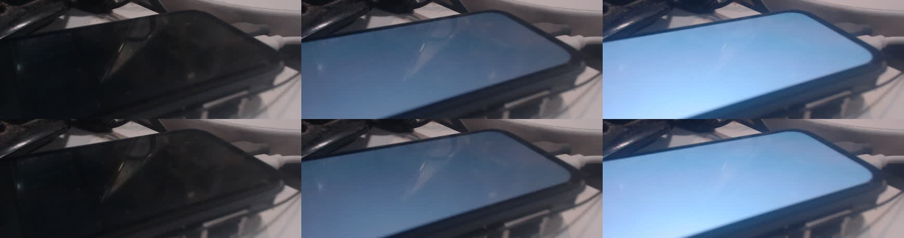
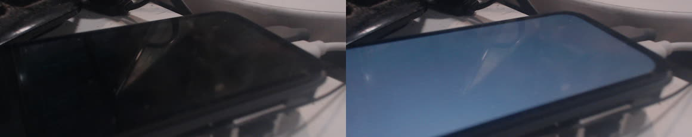
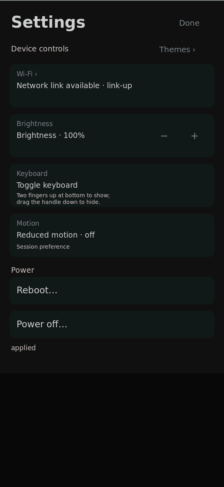

# Combined candidate passes brightness; normal install remains unverified

Physical board, 2026-09-27 UTC. Source `433a4226`, candidate system
`/nix/store/11y992kp7bikr5hg21i2azfvmca43i7i-nixos-system-nixos-26.11.20260919.20b1ddd`.
The combined build includes live HS brightness, rounded cards, the bounded
picker thumbnail working set and the saved-theme store-relocation repair.

The candidate booted once from its staged root-filesystem bundle. Running
and booted system identities matched, all three shell services were active,
and no units were failed. Its kernel Image is byte-identical to the earlier
[camera-proven HS kernel](../live-hs/README.md). Exact boot-file hashes,
runtime executables, capture timestamps and measurements are in
[result.json](result.json).

## Camera and Settings checks

At the same locked camera settings and interior measurement rectangle as
the earlier trial:

| Operation | Levels | Mean grayscale |
| --- | --- | --- |
| Live shell-user writes | raw 26 / 128 / 255 | 26.22 / 91.62 / 172.22 |
| Repeat live write | raw 128 | 92.12 |
| Power off / on | retained raw 128 | 24.23 / 92.02 |
| Settings backend as shell | 10% / 50% / 100% | 26.44 / 91.64 / 172.61 |

Top row: live raw levels. Bottom row: Settings backend percentages.

The commands and camera method are the same as the [HS trial](../live-hs/README.md).
Before DPMS off, an independent 45-second power-on timer was armed and
confirmed active. Direct power-on recovered the panel, and the unused timer
was stopped. No calibrated-nits claim is made.

The actual Settings UI was also exercised with the same Rust executable
on the preceding system `4zq3l00l…`: verified virtual-touch taps at
`(416,345)` and `(494,345)` changed brightness from raw 255 to 230 and back
to 255. The screenshot shows the applied result. This is injected physical
board input, not real-finger acceptance.

## Normal installation interruption

The persistence transaction was launched after the candidate checks, but
the completion check received a new serial autologin session instead of
the requested marker/profile result. Its background output was under
`/run`; that log was not retrieved before reboot. The failure phase is
therefore unknown: no early-exit, rollback or successful-install claim is
supported.

The subsequent normal boot selected the earlier `9h5z3gk…` init path and
loaded a 27,314,664-byte initrd, whereas the candidate's is 27,313,841 bytes.
See the allowlisted [boot excerpt](normal-boot-excerpt.txt). The collector
incorrectly accepted a stale preboot prompt after seeing the new kernel
header and stopped early. That log alone does not demonstrate a kernel
hang. Independent follow-up serial probes returned no bytes, and SSH was
unavailable. A physical reset was requested so the coordinator can load
the already-tested staged candidate again.

Normal installation, task 6.4 and archive remain **UNVERIFIED / open**.
The retry must record a durable phase/result log from the first preflight,
run outside the login session, verify candidate boot hashes and system
profile before reboot, and then wait for a fresh root prompt after the new
kernel header. The host reboot checker has been corrected; it has not yet
completed that corrected normal-boot check on this board.

## Source-based installer diagnosis

The [exact attempted transaction](persist-attempt.txt) copies another full
bundle into hidden `/boot/.k230-panel-next-*` files before its EXIT trap is
installed. `nix/sd-image.nix` defines a 112 MiB boot partition. The candidate
bundle is 87,814,083 bytes (about 84 MiB), while the existing bundle occupies
about the same amount. The shadow copies cannot fit. This is a definite
capacity defect in the helper, although the lost transaction log means we
cannot tell whether an earlier precondition failed first on this attempt.

The corrective transaction must keep staging and backups on the larger
root filesystem, check final/per-file replacement capacity, install its
failure handler before preflight, and copy the verified boot files only
inside the guarded replacement phase. This is not an atomic multi-file
update: interruption during replacement needs recovery through the preserved
root-filesystem bundle. Inspect and remove only the coordinator's own partial
hidden staging files after recovery; never clean unrelated boot files.
