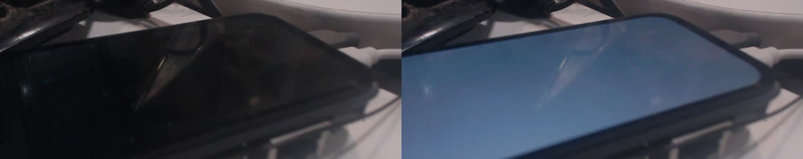
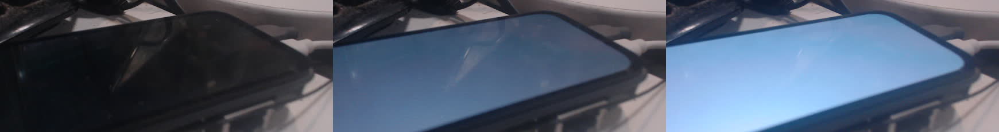

# Live brightness works with HS command delivery

Physical board, 2026-09-27 UTC (September 26 local time). Source
`d76e126f76de1164f07cef09feabb456ecace149`, system
`/nix/store/g27v3arkgwrqsk3ja6589fyjq5wnk72i-nixos-system-nixos-26.11.20260919.20b1ddd`,
kernel `/nix/store/9w07l7qyhd3xykq9wfhjlg3qqc3ijqhs-linux-riscv64-unknown-linux-gnu-6.6.36-xuantie`.

Both running and booted system identities matched this candidate after a
one-time U-Boot boot. Shell, UI and keyboard services were active, with no
failed units. Normal boot files were unchanged during this trial. The
[transport change](../transport/video-brightness-hs-trial.md) sends only
the two-byte `0x51` brightness command in HS while video is active; it does
not cycle display power or change video/PHY registers.

## Fixed-exposure camera proof

The fullscreen Foot window used `colors-dark.background=ffffff`. Camera
exposure, gain, white balance and focus were locked. Each capture discarded
45 frames from MJPEG 1280×720 at 30 fps. Mean grayscale uses the interior
rectangle `(500,350)-(800,425)` in the original frames. These are comparative
camera values, not calibrated nits. The operator repositioned the device;
the previous LP trial is not a matched-framing brightness comparison.

| Operation | Requested brightness | Mean grayscale |
| --- | ---: | ---: |
| Live shell-user write | raw 26 | 26.69 |
| Live shell-user write | raw 128 | 91.56 |
| Live shell-user write | raw 255 | 172.36 |
| Repeat live write | raw 128 | 92.12 |
| Output off | retained raw 128 | 24.15 |
| Output on | retained raw 128 | 91.50 |
| Settings backend | 10% | 27.04 |
| Settings backend | 50% | 91.92 |
| Settings backend | 100% | 172.61 |

**Live writes produce three visibly distinct levels without an intervening
DPMS cycle.** Left to right: raw 26, 128, 255.


Power off/on recovers the display at the requested nondefault level, 128:



The Settings backend, invoked as the unprivileged shell user, reports
`applied` at 10%, 50%, 100%, and the camera confirms each change:



## Commands and limits

```sh
runuser -u shell -- sh -c 'echo 128 > /sys/class/backlight/canaan-dsi-backlight/brightness'
runuser -u shell -- env XDG_RUNTIME_DIR=/run/shell k230-settings brightness 50
runuser -u shell -- env XDG_RUNTIME_DIR=/run/shell SWAYSOCK=/run/shell/sway-ipc.sock swaymsg output DSI-1 power off
runuser -u shell -- env XDG_RUNTIME_DIR=/run/shell SWAYSOCK=/run/shell/sway-ipc.sock swaymsg output DSI-1 power on
```

The level sequences were 26/128/255/128 and then Settings 10/50/100. Before
DPMS off, an independent 45-second recovery timer using absolute executable
paths was confirmed active. Direct power-on succeeded and the unused timer
was stopped. All three shell services remained active.

[result.json](result.json) records source, boot-file hashes, timestamps,
camera settings, raw frame hashes, measurements and backend responses.
Published sheets use FFmpeg crop `1160:460:100:180`, scale 580×230, then
horizontal concatenation. Full desk images and raw serial logs remain local.

This proves physical luminance changes, shell-user controls and DPMS
retention on this candidate. It is not a real-finger Settings interaction,
a calibrated luminance measurement or persistent-install proof. DCS read
diagnostics remain unsuccessful; successful panel reads are not claimed.
Persistent installation and its reboot identity check are recorded separately.
