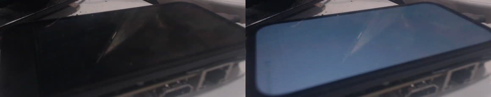
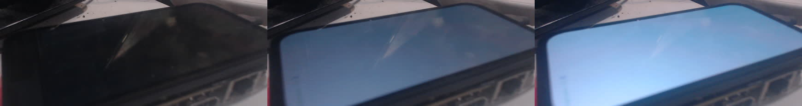

# Panel recovery works; live LP brightness remains ineffective

Physical board, 2026-09-27 UTC (September 26 local time). Candidate source
`926c7a6105f222665b8929f3ca271c3bc19f1458`, system
`/nix/store/l9bla6rxrr13pq2pfzbqk3094d4wx1s5-nixos-system-nixos-26.11.20260919.20b1ddd`,
kernel `/nix/store/fmhnsgvp375vfwz354l4aawxd83h72xy-linux-riscv64-unknown-linux-gnu-6.6.36-xuantie`.
The combined boot bundle is identified in [the build record](../transport/build.json).

A one-time U-Boot boot loaded the candidate from the root filesystem,
without changing normal `/boot` files or saving the U-Boot environment.
Both `/run/current-system` and `/run/booted-system` resolved to the candidate.
The actual compositor executable was
`/nix/store/7zvingic0whhz3z80w2gcpc343vipf7q-sway-unwrapped-riscv64-unknown-linux-gnu-1.12/bin/sway`.
Shell, UI and keyboard services were active; no units were failed.

## Camera result

The operator improved camera framing before these captures. A fullscreen
Foot window used `colors-dark.background=ffffff`. Camera exposure was
manual, exposure time 97 (camera readback), gain 170, white balance fixed at
3588, focus fixed at 30, dynamic frame rate disabled. All captures used
MJPEG 1280×720 at 30 fps, discarding the first 45 frames. The measurement
is mean grayscale in the same interior rectangle `(500,350)-(800,425)` of
the original frame. These are comparative camera values, not calibrated nits.

| Operation | Requested raw brightness | Mean grayscale |
| --- | ---: | ---: |
| Live write | 26 | 172.90 |
| Live write | 128 | 172.57 |
| Live write | 255 | 172.43 |
| Repeat live write | 128 | 172.90 |
| Output power off | retained 128 | 25.45 |
| Output power on | retained 128 | 94.21 |
| Live write after recovery | 26 / 128 / 255 | 93.40 / 93.07 / 93.62 |
| Write followed by off/on | 26 | 27.38 |
| Write followed by off/on | 128 | 93.12 |
| Write followed by off/on | 255 | 173.89 |
| Restore followed by off/on | 254 | 172.99 |

Live writes at 26, 128, 255, left to right: **no demonstrated effect**.


Power off then on with requested 128 retained: **panel recovers**.



The same 26, 128, 255 values, each followed by off/on: **three distinct
levels**. This diagnoses command delivery during re-enable; cycling power
on every brightness change is not an implemented or accepted UI solution.



The published contact sheets crop each reviewed camera frame to
`1160:460:100:180`, scale it to 580×230 and concatenate it horizontally
using FFmpeg. Raw frame hashes, capture timestamps and measurements are
in [result.json](result.json); raw full desk images remain local.

## Commands and limits

All brightness writes ran as the unprivileged `shell` user:

```sh
runuser -u shell -- sh -c 'echo 128 > /sys/class/backlight/canaan-dsi-backlight/brightness'
runuser -u shell -- env XDG_RUNTIME_DIR=/run/shell SWAYSOCK=/run/shell/sway-ipc.sock swaymsg output DSI-1 power off
runuser -u shell -- env XDG_RUNTIME_DIR=/run/shell SWAYSOCK=/run/shell/sway-ipc.sock swaymsg output DSI-1 power on
```

Before the first off/on experiment, a separate systemd timer was confirmed
active, armed to request power on after 45 seconds using absolute binary
paths. The direct on command recovered the panel; the unused timer was
stopped afterward. Repeated cycles also recovered. This does not test
battery suspend or prove recovery from a kernel hang.

Every live write returned success and the requested sysfs value. The
panel log reported a four-byte short packet result. Success and FIFO drain
do **not** establish that active-video LP commands reach the panel. DCS
read diagnostics still failed (`0x04`: -22; `0x0a`: -110); successful reads
are not claimed. A read-only `/dev/mem` snapshot was denied by the kernel;
no register was written and no snapshot was obtained.

The GPIO power restoration and nondefault re-enable behavior have camera
proof. The core live brightness requirement remains **UNVERIFIED / negative**,
so tasks 6.3 and 6.4 remain open and this trial did not install the candidate
persistently. No Settings tap or real-finger acceptance is claimed. The
next bounded experiment is HS delivery of brightness during video, keeping
LP for command-mode initialization and leaving video/PHY/power unchanged.
