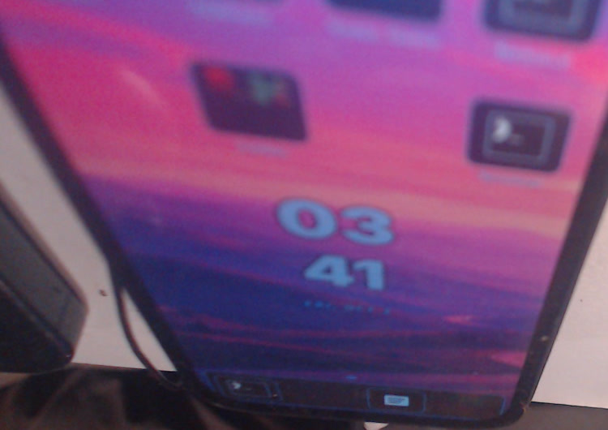
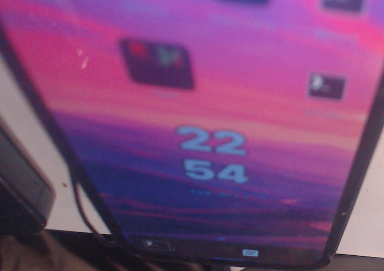

# Working baseline and matching candidate: same manual boot path

2026-10-01 local date. Both runs pass on the reserved physical board:

```
python3 tools/coherent-shell-board-boot.py --candidate /nix/store/pnci1pzsca9f45mfyakcrzyk7yx2ad42-k230-coherent-shell-boot-files --state ~/tmp/k230-coherent-boot-board/state.json --output ~/tmp/k230-coherent-boot-board/baseline --baseline
python3 tools/coherent-shell-board-boot.py --candidate /nix/store/pnci1pzsca9f45mfyakcrzyk7yx2ad42-k230-coherent-shell-boot-files --state ~/tmp/k230-coherent-boot-board/state.json --output ~/tmp/k230-coherent-boot-board/candidate-repeat
```

Source is the controller at `635946835f4a2803acbcff8146aa17ab4e9bd336`;
each result records its exact SHA256. The protected root backup supplied the
baseline's original Image/initrd/DTB/args and the shared OpenSBI wrapper. The
candidate supplied its inspected matching Image/initrd/DTB/args. Identical
addresses, CR-only controller, root partition loads, exact sizes and in-memory
CRCs were used. The captured `bootcmd`/`blinux`/`preboot` response hashes agree.
No persistent env, normal file, selector or profile change occurred.

| Observation | Baseline | Candidate |
| --- | --- | --- |
| Selected system | `x1xbs5…` | `p1a1hz…` |
| Executed Image | `p6z5ns…` | `03zyl0…` |
| Explicit init | matching baseline init | matching candidate init |
| Persistent profile | original `r0knnb…` | original `r0knnb…` |
| Shell/UI/theme services | active | active |
| Visible Home after hide + `card_shell home` | photographed | photographed |

See `baseline.json` and `candidate.json` for full store paths, boot IDs and
loaded-file hashes. The baseline clock shows its older UTC behavior; the
candidate shows the configured Chicago time. Neither observation identifies
the earlier dark-terminal ambiguity as a display driver defect.





Photos use the same FFmpeg crop command as the preceding candidate evidence;
the device extends beyond the camera frame. Both were reviewed. No new native
capture, QEMU proof or finger contact is claimed by the camera.

The operator then explicitly accepted the requested three real-finger cases:
Home→All apps, bottom handle→Overview, and Terminal open/return. The report
`1. good.` is preserved in
`../coherent-manual-candidate/operator-navigation.json`, bound to this exact
bundle/system/kernel and Rust executable. This accepts manual candidate
navigation; it does not yet prove ordinary persistent boot or every Home
editing action. No additional source/configuration repair was required to
obtain these visible, usable vendor-kernel results.

The installer now has host tests (7 pass) for exact operator qualification,
atomic copies, insufficient-space refusal, protected-selector refusal and a
simulated interrupted root-backed copy. Five plan and five UART tests also
pass. Those are host failure-handling checks, not a physical interrupted-write
experiment. Installation and ordinary reboot remain the next board gate.
