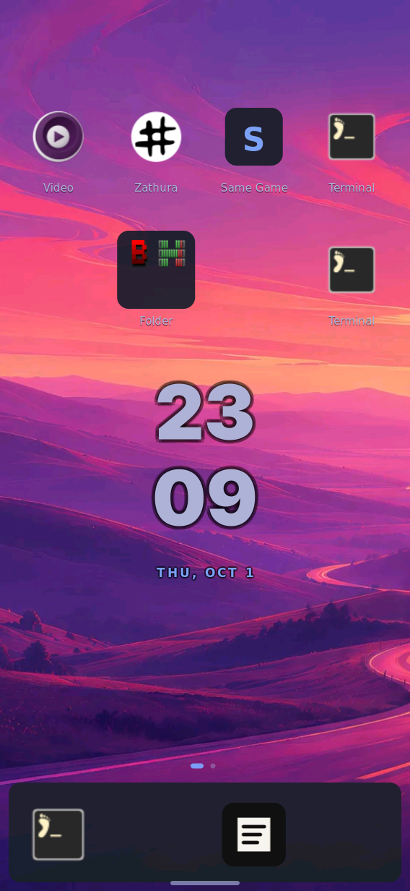

# Selected coherent shell survives ordinary reboot

2026-10-01, America/Chicago. Physical board, root coordinator owns serial.
The touch-qualified bundle is now installed as the normal boot selection:

```
python3 tools/coherent-shell-board-boot.py \
  --candidate /nix/store/pnci1pzsca9f45mfyakcrzyk7yx2ad42-k230-coherent-shell-boot-files \
  --state ~/tmp/k230-coherent-boot-board/state.json \
  --qualification docs/evidence/boot-verification/coherent-manual-candidate/operator-navigation.json \
  --output ~/tmp/k230-coherent-boot-board/ordinary --install
```

Controller/installer source: `0b7fa19f54ec380368ff370190fab43900f96fe9`.
`boot-result.json` records the controller SHA256, exact selected system, kernel,
initrd and DTB, all eight original/installed boot-file identities, and actual
installation methods. Only Image, initrd, DTB and bootargs were replaced;
OpenSBI/stage 1 and all three selectors are unchanged. Persistent profile
now selects `p1a1hz…`, matching the explicit boot init and current system.

The boot partition cannot hold both kernels. Image and initrd required checked
root-backed replacement, with an interruption window between removal and rename.
The installer journals each phase and retains verified backups and GC roots on
root; this is not an atomic whole-bundle installation. Unit tests exercise an
interrupted copy and protected-file/qualification refusals, not a physical
power-cut experiment.

After the installer returned PASS, the controller issued ordinary `reboot`.
It did not interrupt autoboot or supply a manual boot command. Linux returned
with the selected kernel, explicit init, current system and persistent profile;
`shell`, `shell-ui` and `theme-helper` were active. `serial-observations.txt` retains the whitelisted actual Linux version, command
line and identity response from the private serial transcript.
`postboot.json` independently
records the same identity, the running Rust ELF, all eight installed hashes,
and configured America/Chicago timezone.

The active appearance generation and its report hash match both pre-install and
post-install values after reboot. This verifies remembered theme/wallpaper for
this existing home, not fresh-image defaults or every upstream theme option.




Home was shown with the running Rust client's `--surface hide` and the real
compositor's `swaymsg 'card_shell home'`, then captured with `grim`. The panel
photograph used:

```
ffmpeg -nostdin -hide_banner -loglevel error -f v4l2 -input_format mjpeg \
  -video_size 1280x720 -i /dev/video0 \
  -vf 'crop=750:530:530:185,transpose=2,transpose=2' \
  -frames:v 1 -q:v 2 -y ~/tmp/k230-coherent-boot-board/ordinary-home-panel.jpg
```

Both images were visually reviewed. The panel extends beyond the camera frame;
the native capture shows the full frame. These observations are physical boot,
serial identity, native capture and camera evidence. They do not substitute for
real-finger contact. Prior real-finger qualification is bound to these exact
artifacts in `../coherent-manual-candidate/operator-navigation.json`; a separate
post-ordinary-boot confirmation remains requested.

## Recovery retained

Protected board stage:
`/var/lib/k230/coherent-boot/p1a1hz9n8s4g8qyr55ffl3dzbnjgqwr8-20261001`.
Original eight files live in its `backup/`, original init/profile closures have
GC roots, and the installer state/result are retained. For a failed boot, stop
at U-Boot on the exclusively reserved serial port, then run the root-backed
baseline controller:

```
python3 tools/coherent-shell-board-boot.py \
  --candidate /nix/store/pnci1pzsca9f45mfyakcrzyk7yx2ad42-k230-coherent-shell-boot-files \
  --state ~/tmp/k230-coherent-boot-board/state.json \
  --output ~/tmp/k230-coherent-boot-board/recovery --recover-baseline
```

After the old normal init reaches Linux, restore files/profile using the staged
installer (root console), then reboot normally and check identities and Home:

```
/nix/store/v189xydz6qkcd4cbkixcmv91w8hbc560-python3-riscv64-unknown-linux-gnu-3.14.7/bin/python3 \
  /var/lib/k230/coherent-boot/p1a1hz9n8s4g8qyr55ffl3dzbnjgqwr8-20261001/install.py \
  rollback /var/lib/k230/coherent-boot/p1a1hz9n8s4g8qyr55ffl3dzbnjgqwr8-20261001
reboot
```

Do not invoke rollback casually: it deliberately reselects the previous system.
The original baseline's same-path manual boot was physically proved before
installation (`../coherent-manual-comparison/`). This successful install did not
exercise physical failed-write rollback. Private transport credentials and raw
serial logs remain outside Git under protected `~/tmp` files.

## CI correction

The source run `36962592218` failed because the installer test fixture assumed
`~/tmp` existed on a fresh GitHub runner. Commit `a9f7a24b` creates it before
allocating temporary fixtures. Seven installer, five boot-plan and five strict
UART tests pass locally after that correction; matching CI/Pages run `36963303088` passed build and deployment.
