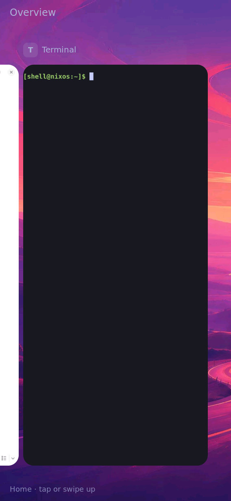
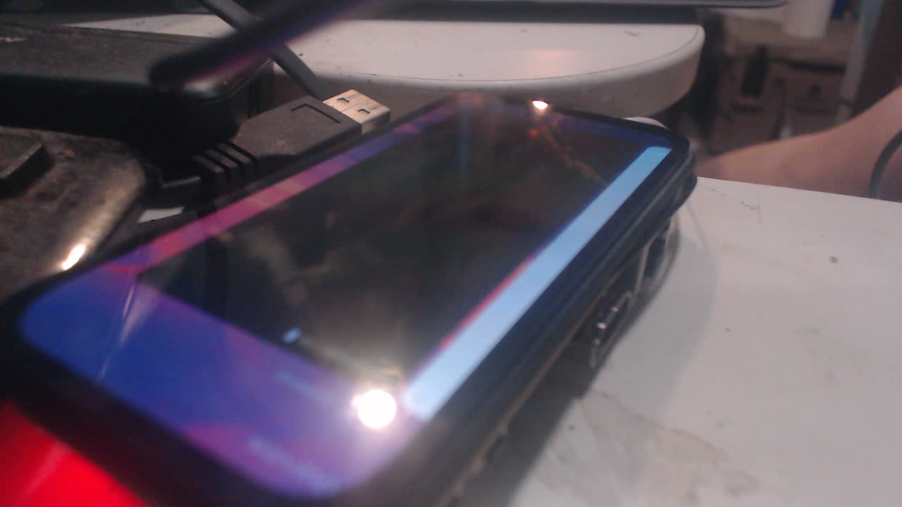

# Themed overview: physical closeout

On 2026-09-30 (America/Chicago), the operator used the installed panel shell with real finger input and explicitly reported: **“home icons don’t appear behind the cards.”** The operator then framed the camera on the settled overview. A real Foot card is selected, the actual configured wallpaper is visible, and Home grid/dock icons are absent.





The matching [sanitized console probe](console.txt) reports `active=1`, `appearance_enabled=1`, `appearance_wallpaper=1`, a transparent overview canvas and `home_enabled=0`. [Capture provenance and original hashes](capture.json) distinguish the native image from the optical photo. The board and serial port were reserved by the coordinator with `/tmp/k230-board.lock`; there was no flash, kernel change or reboot during collection.

Commands (run from the repository while holding the reservation):

```sh
python3 tools/console.py /dev/ttyACM0 --wait=3 'runuser -u shell -- env SWAYSOCK=/run/shell/sway-ipc.sock timeout 3s swaymsg -r "card_shell enter"; runuser -u shell -- env SWAYSOCK=/run/shell/sway-ipc.sock timeout 3s swaymsg -r "card_shell debug-scene"'
python3 tools/console.py /dev/ttyACM0 --wait=3 'runuser -u shell -- env XDG_RUNTIME_DIR=/run/shell WAYLAND_DISPLAY=wayland-1 grim -t jpeg -q 85 /run/shell/overview-proof.jpg'
ffmpeg -hide_banner -loglevel error -f v4l2 -i /dev/video0 -frames:v 1 -y overview-panel.jpg
```

The native image was obtained before the repeat `enter` command, while the same operator-entered overview was visible. The console state after repeat entry stayed consistent. The panel photograph has glare and an oblique angle: it records the lit physical panel and overall composition, while the native image provides readable pixels and the operator supplies the real-glass behavior check. These stills do not prove latency or every motion path. Existing headless entry/mid-drag/settlement and self-healing regressions remain their separately identified evidence class.

This closes task 5.1 of `the-overview-hides-the-home-screen`; it does not close other card-motion, performance, Home-placement or persistent-boot proposals.
