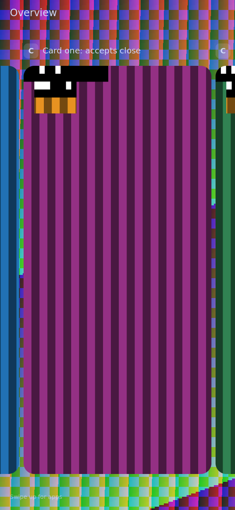

# Live cards reveal the wallpaper through rounded corners

**Headless QEMU capture — not a board screenshot or a design mockup.**
The actual cross-built Sway/Pixman compositor now clips live card draws to
rounded geometry. The previous implementation painted solid theme-colored
patches over the corners, which visibly interrupted a wallpaper.



[Before: opaque corner patches](before.png) ·
[Unobscured wallpaper baseline](baseline.png) ·
[Held horizontal drag](drag-held.png) ·
[Held app-to-overview gesture](entry-held.png) ·
[Held direct app switch](direct-switch-held.png) ·
[Opened app](opened.png) ·
[ARGB client and translucent corner subsurface](argb-child.png)

These synthetic moving-band clients deliberately expose stale pixels and
edge errors. This patterned wallpaper is generated by the fixture to make
incorrect solid fills obvious; these are correctness captures, not a proposed
visual theme. Native screenshots and user touch acceptance remain open.

## What passed

- The independent host pixel oracle compares 288 cases against a full-size
  reference mask: wallpaper preservation, opaque and premultiplied-alpha
  sources, opacity, source transforms, partial child bounds, changing radii,
  damage clips, and RGB565 destinations. The production helper draws the
  interior normally and masks only the four small corner squares.
- The existing policy and RGB565 cache tests still pass: **38 pytest cases**
  including the new pixel test. The pixel oracle also passes ASan/UBSan
  with leak detection.
- The exact cross-built compositor passed the QEMU fixture with the RGB565
  cache enabled, with it disabled, and with an ARGB parent plus a half-alpha
  subsurface at the parent's top-left corner. All runs use RGB565 output
  (`render_format: RG16`). Eight points at the selected and partially
  clipped neighboring card corners exactly match the baseline wallpaper.
  Live app pixels also change between captures.
- The same fixture against `master` base `bb427e19` fails at the first
  corner: RGB `(24,28,41)` instead of wallpaper `(49,81,41)`. This negative
  control detects the old corner-paint behavior rather than merely checking
  that the compositor runs. The final fixture also asserts live content
  in both neighbor slivers, preventing an absent neighbor from trivially
  passing a wallpaper-to-wallpaper comparison.
- The held-drag, direct-switch, entry and opened captures were visually
  reviewed. The selected card and neighbors have rounded silhouettes over
  the wallpaper; small entry radii and square full-screen geometry remain
  tied to the existing gesture geometry. Static captures do **not** prove
  smoothness or physical finger feel.

The fixture's first draft omitted its appearance-socket setting and therefore
showed the solid fallback; it correctly failed the wallpaper comparison.
Visual review also caught unstable concurrent client mapping, which could
leave one neighbor off-screen. The final fixture maps clients sequentially
and checks both slivers before accepting the corner result.
Those fixture setup errors are not counted as compositor failures or passing
wallpaper trials. The corrected fixture and final-binary trials are committed.

## Source and artifacts

Source: `4b33dda9` on `fix/transparent-card-corners`, based on `bb427e19`.
The code checkpoint is `d67c600b`; the follow-up also makes the wallpaper
pause calculation honor rounded transparency. The RGB565 thumbnail cache
format and byte budget remain unchanged.

- Package: `/nix/store/7pjmarasi2x8nbmzsy67anl0n6slnbgy-k230-card-shell`
- Sway: `/nix/store/7zvingic0whhz3z80w2gcpc343vipf7q-sway-unwrapped-riscv64-unknown-linux-gnu-1.12/bin/sway`
- [Artifacts, hashes and capture timestamps](artifacts.json)
- [Cache-enabled result](cache-result.json), [direct-draw result](direct-result.json),
  [ARGB/corner-child result](argb-result.json)
- [Renderer format and cache observations](renderer-observations.txt)
- [ARGB fixture build identity](argb-client-build.json)

The local wlroots extension is implemented in the production **Pixman**
renderer. It adds scene damage, conservative rounded opaque regions, and
rejects direct scanout for clipped nodes. It does not add or claim rounded
rendering in the separate experimental VG-Lite/GLES/Vulkan paths. CPU cost
and frame pacing on the physical board are **UNVERIFIED**.

## Reproduce

From the repository root:

```sh
python3 -m pytest tests/test_card_rounded_clip.py tests/test_card_scaled_cache.py tests/test_card_shell_state.py -q
cc -std=c11 -Wall -Wextra -Werror -g -fsanitize=address,undefined -fno-omit-frame-pointer -I nix/card-shell tests/card_rounded_clip.c $(pkg-config --cflags --libs pixman-1) -lm -o /tmp/k230-rounded-asan
ASAN_OPTIONS=detect_leaks=1 /tmp/k230-rounded-asan
nix build .#card-shell --max-jobs 1 --cores 4 --no-link --print-out-paths
```

Build the ordinary host probe from the unchanged source:

```sh
mkdir -p /tmp/k230-rounded-client
wayland-scanner client-header /usr/share/wayland-protocols/stable/xdg-shell/xdg-shell.xml /tmp/k230-rounded-client/xdg-shell-client-protocol.h
wayland-scanner private-code /usr/share/wayland-protocols/stable/xdg-shell/xdg-shell.xml /tmp/k230-rounded-client/xdg-shell-protocol.c
cc -std=c11 -O2 -Wall -Wextra -Werror -I /tmp/k230-rounded-client nix/card-composition-probe-client/card-composition-probe-client.c /tmp/k230-rounded-client/xdg-shell-protocol.c $(pkg-config --cflags --libs wayland-client) -o /tmp/k230-rounded-client/client
```

The checked-in ARGB variant builder uses explicit substitutions, leaving
the ordinary probe source untouched:

```sh
python3 tests/build_card_rounded_probe.py --output /tmp/k230-rounded-argb-client
python3 tests/card_rounded_clip_qemu.py \
  --sway /nix/store/7zvingic0whhz3z80w2gcpc343vipf7q-sway-unwrapped-riscv64-unknown-linux-gnu-1.12/bin/sway \
  --client /tmp/k230-rounded-client/client \
  --swaybg /nix/store/yhh05srfyhf81cdrm0f9ckxajjgh9qql-swaybg-riscv64-unknown-linux-gnu-1.2.2/bin/swaybg \
  --cache 1 --output /tmp/k230-rounded-complete-cache
```

Repeat with `--cache 0` for direct draws, and with
`--client /tmp/k230-rounded-argb-client/client` for the ARGB/corner-child
case, choosing a fresh output directory each time. The negative control
uses Sway
`/nix/store/vvca8zksyarjb7s7vfrs1p9c9lpp9jnn-sway-unwrapped-riscv64-unknown-linux-gnu-1.12/bin/sway`
and is expected to exit 1 at the wallpaper assertion.

## Remaining physical gate

No board, serial port, system activation or flash was used for this slice.
After coordinator review/integration, build the combined system and perform
a guarded activation. Capture the installed compositor over an actual theme
wallpaper with live apps; record the system/Sway store paths and native
screenshot. Keep real-finger gesture smoothness acceptance separate. The
OpenSpec change remains open for those gates.
