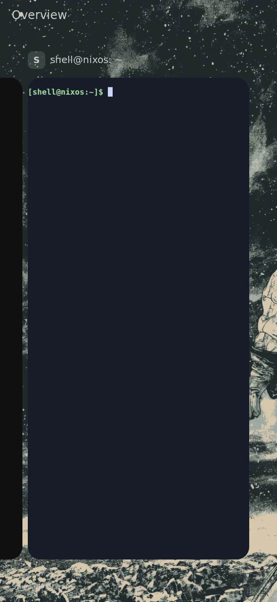

# Rounded live cards on the physical board

**Board capture: native screenshot during a guarded compositor trial.**
The selected terminal card and partially visible left neighbor have rounded
corners revealing the actual selected wallpaper. The earlier native capture
shows square selected-card corners. Both images were visually reviewed.



[Before, from the normal compositor](before.png) · [Identities and hashes](result.json)

This is not a camera recording, real-finger acceptance, or a matching-system
installation. The two captures show different terminal instances after the
session restart; their colors/titles differ, so this is a visual geometry
comparison rather than a controlled pixel-difference benchmark. The QEMU
fixtures in the parent directory provide that controlled comparison.

## Trial and restoration

The board was reserved with `/tmp/k230-board.lock`. The normal and booted
system both resolved to `9h5z3gk24gb3kdal037plsxqrmd7dx1y`; shell, shell-ui,
and shell-keyboard were active. Six new closure paths (8,230,824 NAR bytes)
were imported, exit 0. No kernel, boot files, saved theme or credentials
were changed.

An independent eight-minute systemd timer was armed before creating the
single owned runtime drop-in:
`/run/systemd/system/shell.service.d/91-k230-rounded-trial.conf`.
It replaced only ExecStart, retaining the installed environment/config:

```ini
[Service]
ExecStart=
ExecStart=/nix/store/7pjmarasi2x8nbmzsy67anl0n6slnbgy-k230-card-shell/bin/sway -d -c /nix/store/77njgmyf1lldv3vnsq79nhasa85ad0c8-k230-sway.conf
```

After `systemctl daemon-reload` and `systemctl restart --no-block
shell.service`, `/proc/$(systemctl show -p MainPID --value shell)/exe`
resolved to the exact trial Sway recorded in result.json; all three shell
services and the restoration timer were active.

As `shell`, from `/home/shell`, with `XDG_RUNTIME_DIR=/run/shell`,
`SWAYSOCK=/run/shell/sway-ipc.sock` and `WAYLAND_DISPLAY=wayland-1`:

```sh
swaymsg exec 'foot --app-id=k230-rounded-proof --title=Terminal'
swaymsg card_shell enter
# Capture again after the entry has settled.
grim /run/shell/k230-rounded-board.png
```

The PNG was collected via base64 over the serial console. Raw serial logs
remain private. An initial `systemctl show` entered its pager; the operator
exited it and repeated with `--no-pager -l` before deriving the exact command.
This operator issue was not counted as a compositor test.

The initial recovery service failed to remove the drop-in: its minimal PATH
contained `systemctl` but not `rm`. Its final restart returned success,
so the unit result alone was misleading. The required post-recovery
executable/path checks caught this: trial Sway and the drop-in remained.
No restoration pass is claimed for that attempt.

The operator corrected recovery with a separate, waited transient service:

```sh
systemd-run --unit=k230-rounded-trial-cleanup --wait /bin/sh -c 'set -e; /run/current-system/sw/bin/rm -f /run/systemd/system/shell.service.d/91-k230-rounded-trial.conf; /run/current-system/sw/bin/systemctl daemon-reload; /run/current-system/sw/bin/systemctl restart shell.service'
```

A follow-up check after startup confirmed the normal Sway executable,
all three active shell services, and absence of the owned drop-in. The timer
was stopped. Future recovery commands must use explicit executable paths
and fail on the first error; unit success alone is not restoration proof.
The temporary trial does not complete task F.3's matching-system installation
or E.1's physical gesture acceptance.
