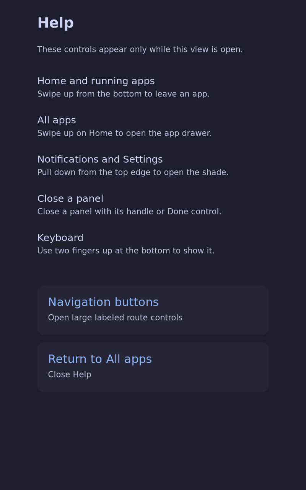

# Combined coherent-shell board candidate — 2026-10-10

Coordinator `/root`, worktree `/home/jadams/tmp/k230-coherent-closeout-2026-10-10`,
branch `closeout/coherent-integration-2026-10-10`, base and candidate source
`093a82a0c31007f775ad260492e30d3088739548`. Owned paths are this evidence
directory and the coherent-shell task references. Build and serial operations
use the exclusive `/tmp/k230-nix-build.lock` and `/tmp/k230-board.lock`.

This candidate combines the committed drawer tracking/interruption fixes,
settled-center theme admission, deferred Foot refresh and its matching Rust
reply parser, and Help with deliberately opened navigation buttons. It uses
the daily mainline HDMI-hotplug configuration, not the vendor rollback kernel.
Earlier host/QEMU proofs and actual operator acceptance of the older installed
HDMI system remain separate from this candidate's physical evidence.

## Baseline inspection

The reserved read-only serial check is retained as [preflight.json](preflight.json).
It identifies the accepted `yl3si5…` normal system/profile, `f3rnip…` mainline
kernel, boot ID `4bf73b24-a16a-4786-96fb-f1288244d96f`, older `q2rxmp…` Rust
client, and active shell, shell-ui, theme-helper and HDMI touchpad services.
The normal system matches the earlier committed HDMI installation report.
No reboot, input injection, photo, or real-finger test happened in this check.

Exact host command, under the board lock:

```sh
python3 tools/console.py /dev/ttyACM0 --wait=3 \
  'readlink -f /run/current-system; readlink -f /run/booted-system/kernel; readlink -f /nix/var/nix/profiles/system; cat /proc/sys/kernel/random/boot_id; systemctl is-active shell shell-ui theme-helper k230-touch-trackpad; readlink -f /proc/$(systemctl show -p MainPID --value shell-ui)/exe'
```

Raw UART output and runtime transport details stay in protected files outside
Git. The public report admits only identity paths, a boot ID and service states.

## Matching build

```sh
flock -n /tmp/k230-nix-build.lock nix build \
  'git+file:///mnt/MediaVolume/home/jadams/src/gitlab.daringbit.com/josh/tdisplay-k230?rev=093a82a0c31007f775ad260492e30d3088739548#kernelMainlineDrmShellBootFiles' \
  --out-link "$HOME/.local/state/tdisplay-k230/retained-builds/coherent-combined-2026-10-10/candidate" \
  --print-out-paths --max-jobs 1 --cores 2
```

The same immutable selector with `--dry-run --no-link` passed. Its plan lists
38 builds and nine fetched paths (2.9 MiB download, 11.7 MiB unpacked), with no
kernel, compositor, RISC-V Rust client or graphics-library rebuild. The native
wallpaper-cache tool shares Rust shell source; Help changes its derivation and
therefore the generated theme bundle. The changed package must build even
though its compiler and dependency outputs remain cached. The plan also
includes `iw`, `htop`, configuration files, wrappers and system/boot assembly.
This plan does not establish that garbage collection removed any dependency.

The existing verified 10,405-path Help retention farm remains rooted. The
candidate output has a separate durable GC root; build-input retention and
matching host inspection are recorded with the completed build below. The initial plan is retained as
[build-plan.log](build-plan.log).

## Guarded board procedure and evidence limits

Before running the guarded controller, its narrow tests passed:

```sh
python3 tests/test_coherent_shell_board_stage.py
python3 tests/test_coherent_shell_board_boot.py
python3 tests/test_coherent_shell_board_install.py
python3 tests/test_rvv_board_boot.py
```

Results: 3 stage, 5 boot-plan, 10 installer and 5 UART tests passed. These are
host fixture tests, not a physical rollback or power-cut experiment.

The existing stage tool imports and validates the candidate closure, preserves
all eight normal boot files, verifies the unchanged persistent profile, and
roots the candidate. The temporary boot controller CRC-checks each loaded
artifact and selects the matching system only in volatile U-Boot state. A
normal reboot returns to the accepted HDMI boot selection while that selection
is unchanged. Persistent installation requires a separate operator report
bound to this exact bundle and system; old acceptance is not reused.

The coherent-shell proposal remains open. No named camera, real-finger,
timing, six-surface polish or ordinary persistent-boot task is completed by
this host build, read-only inspection or a temporary serial boot.

## Completed host qualification

[build-result.json](build-result.json) and [build.log](build.log) record the
successful 38-derivation build. Selected bundle:
`/nix/store/hzz623hn3wxvr4b1536591pr5y5drnby-k230-coherent-shell-boot-files`;
system `svjjlnvrs8djb6g6gkd0q0iwabpm6sxp`. The exact accepted kernel **and
initrd** were reused, and the underlying hotplug DTB source is unchanged.
The wrapped DTB and bootargs select this new system, so their hashes differ.
[host-inspection.json](host-inspection.json) passes kernel bytes, initrd payload
and wrapper CRCs, DTB reconstruction, exact init selection and registered
closure inventory checks. This is not a boot observation.

A subsequent `nix-store --realise --dry-run
/nix/store/jf9kl3f2yrj2yxh0s4m6yx0s5v9n7wb0-k230-coherent-shell-boot-files.drv`
passed with zero builds and fetches; its empty [cached-dry-run.log](cached-dry-run.log)
is normal for an already realized output.

[retention.json](retention.json) verifies all **10,530** union paths are reachable
from the durable farm, including the previous 10,405 paths and 125 new ones.
The new farm nests the previous verified farm and adds 126 direct links,
using `builtins.storePath` contexts rather than unregistered string links.
The global GC policy was unchanged. Exact enumeration and farm recipes are
[retain-inputs.py](retain-inputs.py) and [retain.nix](retain.nix); the protected
local root holds their generated manifests. Commands:

```sh
python3 "$HOME/tmp/k230-combined-retain.py"
flock -n /tmp/k230-nix-build.lock nix-build \
  "$HOME/.local/state/tdisplay-k230/retained-builds/coherent-combined-2026-10-10/retain.nix" \
  --out-link "$HOME/.local/state/tdisplay-k230/retained-builds/coherent-combined-2026-10-10/build-closure" \
  --option max-jobs 1 --option cores 2
```

The first staging attempt was refused by `PrivateSession.upload_text`'s
in-memory pathname allowlist before a helper transfer. Coordinator `/root`
corrected the temporary pathname to its existing `k230-mainline-*.json` format;
the shared transport guard was not weakened. Both raw attempt logs stay private.

## Staging result

[staged-state.json](staged-state.json) records successful preparation on the
physical board: all 1,160 candidate system closure paths are registered and
validated; all eight normal boot files and the persistent normal profile are
unchanged; verified backups and a candidate GC root are retained on root.
The protected stage is
`/var/lib/k230/coherent-boot/svjjlnvrs8djb6g6gkd0q0iwabpm6sxp-20261010`.
[transfer.json](transfer.json) records the 37-path closure delta and SHA256s;
[stage-used.py](stage-used.py) is the actual coordinator transfer script. It
reads the runtime endpoint from the designated protected configuration file,
checks the baseline system/profile/kernel/boot ID, service health and free
space, hashes each download, imports the closure, and runs the existing stage
guard. No credential or runtime address is retained in this evidence.

Actual host invocation:

```sh
python3 "$HOME/tmp/k230-coherent-combined-board-2026-10-10/stage.py"
python3 tools/coherent-shell-board-boot.py \
  --candidate /nix/store/hzz623hn3wxvr4b1536591pr5y5drnby-k230-coherent-shell-boot-files \
  --state "$HOME/tmp/k230-coherent-combined-board-2026-10-10/state.json" \
  --output "$HOME/tmp/k230-coherent-combined-board-2026-10-10/candidate"
```

## Temporary physical boot and native Help

[serial-result.json](serial-result.json) records **PASS** for the actual
reserved board boot. All five loaded artifacts passed their in-memory CRCs;
Linux selected the exact `svjjlnv…` system and matching mainline kernel, with
active shell, UI and theme helper. Fresh boot ID:
`0618821a-6879-46d2-8109-7f130c65888f`. The persistent profile still selects the
accepted `yl3si5…` system. `ordinary_autoboot_observed` is false: this is a
volatile manual candidate boot, not a normal-install claim.

[runtime.json](runtime.json) independently checks the actual running `z4j8bc…`
Rust ELF, `awym9l…` Sway ELF and `y76z6y…` coherent theme helper together, all
four shell/helper/HDMI input services, the matching kernel link, unchanged
normal profile, and all eight normal boot-file hashes. The report binds to
the controller's fresh boot ID. HDMI-A-1 remains enabled at 1280×800 with the
accepted portrait transform, giving an 800×1280 logical output. No cable
cycle, panel touch, theme application or finger interaction was performed by
this script.

```sh
python3 "$HOME/tmp/k230-coherent-combined-board-2026-10-10/runtime-check.py"
```

The [executed host adapter](runtime-check-used.py) runs the exact
[board inspection script](inspect-runtime.py) through the private transport.
On the board, the command is its pinned Python interpreter followed by
`-I /root/tmp/k230-coherent-combined-20261010/inspect-runtime.py STAGE PROTECTED_ENDPOINT`.
The endpoint is never retained publicly. The script requests the actual Help
route programmatically, captures it through native `grim`, then hides that
surface and returns Home through the real compositor. It does not inject a
touch or manufacture an operator report.



The 800×1280 native image was visually reviewed: the guidance and both action
labels are readable, fit the output, and reveal no private app or network
information. Image bytes and SHA256 are in `runtime.json` and the blob inventory.
This is native board rendering proof, not a camera or glass-legibility result.
The serial and build reservations have been released; the candidate remains
running for the requested real-touch navigation check.

## Remaining operator gate and recovery

The coordinator requested the exact new candidate's Home → All Apps,
Terminal → Home, Overview, and All Apps → Help → Navigation buttons →
Home/Settings checks. An HDMI unplug/replug check was also requested if
connected. **No response or real-finger acceptance has yet been obtained.**
Older installed-system acceptance is not copied into a new qualification.
The coherent-shell change remains **30/39** and all nine remaining named
physical/trace/polish tasks are unchecked. No latency measurement was started.

A plain `reboot` returns to the preserved, accepted normal HDMI system.
If the temporary boot becomes unusable, the existing protected-baseline path
remains available to the reserved coordinator:

```sh
python3 tools/coherent-shell-board-boot.py \
  --candidate /nix/store/hzz623hn3wxvr4b1536591pr5y5drnby-k230-coherent-shell-boot-files \
  --state "$HOME/tmp/k230-coherent-combined-board-2026-10-10/state.json" \
  --output "$HOME/tmp/k230-coherent-combined-board-2026-10-10/baseline" --baseline
```

No persistent install, image flash, failed-write rollback, physical power-cut,
six-surface dark/light camera proof or new finger gesture trace is claimed.
Review/landing of this bounded evidence proceeds independently of those gates.
