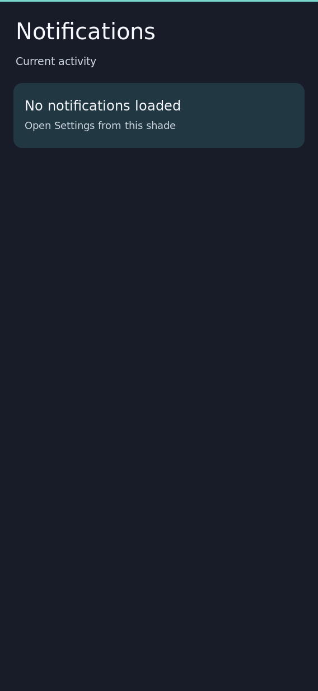
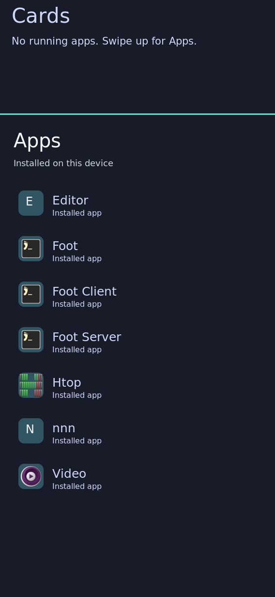

# First integrated Rust shell on the board

Observed 2026-09-24. Source `cd06bee4` produced the system and exact identities
in [result.json](result.json). The coordinator held the board/serial lock,
exported 76 new store paths (171,004,000 bytes), and imported them over the
existing Wi-Fi connection using a temporary single-artifact HTTP transfer.
No image flash or readback occurred; credentials and transport addresses stay
outside Git. A transient Wi-Fi link drop recovered with the saved profile,
a new DHCP lease, and a successful interface-bound outbound ping.

A five-minute root systemd rollback timer targeting the prior system was
confirmed active before `switch-to-configuration test`. Activation returned
zero. `shell`, `shell-ui`, `shell-session-bus`, `shell-notifications`, and
`k230-wifi` were active. The timer was cancelled after native UI capture and
initial user interaction; the previous boot profile remains the reboot
fallback because this activation used `test`, not a persistent boot switch.

These 568×1232 native `grim` captures were visually reviewed:





Commands use the exact store paths in the adjacent result and omit private
transport details:

```sh
systemd-run --unit=k230-coherent-restore --on-active=300s \
  --timer-property=AccuracySec=1s "$previous_system/bin/switch-to-configuration" test
systemctl is-active k230-coherent-restore.timer
"$new_system/bin/switch-to-configuration" test
systemctl is-active shell shell-ui shell-session-bus shell-notifications k230-wifi
runuser -u shell -- env XDG_RUNTIME_DIR=/run/shell \
  WAYLAND_DISPLAY="$discovered_display" grim /run/shell/coherent-start.png
```

The user reported that the shell seemed usable but needed design work, then
found two blocking navigation defects: the pulled-down notification shade
could not be dismissed and selecting another app card left the previous app
visible. The coordinator dismissed the shade through the existing Rust
`--surface hide` route. Both defects require fixes and repeat checks; this
checkpoint does **not** close physical acceptance or the coherent-shell
proposal. Settings and notification actions are still an unfinished surface
in this installed revision. These captures prove native compositor pixels,
not camera-visible presentation timing or performance budgets.

## Navigation correction installed and user checked

The combined correction built from integrated source `8d231e7b` with:

```sh
nix build .#nixosConfigurations.k230-coherent-shell.config.system.build.toplevel \
  --max-jobs 1 --cores 4 --no-link --print-out-paths
```

PASS: `/nix/store/ni904kvqycv8v893wp6i1agskgck821d-nixos-system-nixos-26.11.20260919.20b1ddd`.
A 23-path, 10,376,208-byte delta imported successfully over Wi-Fi. A new
five-minute fallback timer was confirmed active before test activation.
Activation returned zero; the current system matched the target and shell,
Rust UI, session bus, notifications, and Wi-Fi were active. The fallback
timer was then stopped, leaving the corrected preview running.

The fixes add upward-swipe dismissal to the shade and raise the selected
floating window after focusing it. Exact old/new QEMU negative and positive
results are in `docs/evidence/coherent-shell/rust-shade-dismiss-qemu/README.md`
and `docs/evidence/card-shell/focus-raise/README.md`.

After being told the combined update was installed and to retry shade
dismissal and window selection, the user reported: “that worked perfectly”.
This is user-reported on-device acceptance of the navigation update, not a
new camera recording or complete acceptance of every shell requirement.
The initial screenshots above still depict the earlier preview. Settings,
notifications, theme-choice UI, broader design and motion work remain open.
The running update is still a test activation with the original boot profile
retained until the integrated milestone is ready for persistent activation.
