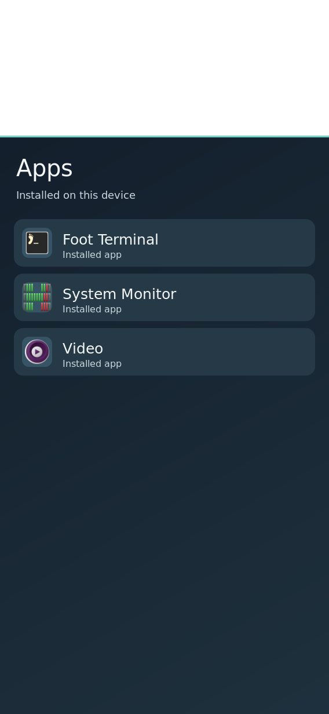

# Rust drawer icon checkpoint

The opt-in Rust drawer reads installed desktop entries through GIO, resolves their `GIcon` using the selected freedesktop theme with bounded inheritance and `hicolor` fallback, then decodes PNG/SVG through Cairo/librsvg. A missing or rejected icon retains its text label and letter tile. Source and `index.theme` files, recursive theme depth, directory count, icon count, decoded icon size, and the 12-entry lazy cache are bounded. Calling `set_theme` clears cached hits and misses even when a new appearance generation selects the same theme name. The current session still needs to call it on theme adoption; this is drawer artwork groundwork, not complete task 1.4.

The host tests cover inherited SVG lookup, native decode, cache reuse/invalidation, malformed names, and a rendered absolute SVG app icon. The fixture screenshot below uses three `.desktop` entries with fixed public labels and their real Nix store Foot, htop and mpv icons. `XDG_DATA_HOME` contained only those entries; `XDG_DATA_DIRS` pointed at the three packages' `share` directories. The client rendered `--render-fixture drawer` at 568×1232. The image is a host software render, not a board photograph or physical interaction result.

The exact icon asset paths, SHA-256 values, source links and license notices are recorded in [the design study's icon provenance](../../design/handheld-prototype/README.md). The screenshot contains no private app catalog or device data.

Remaining: exact riscv64 cross-build with librsvg, theme generation hook, actual app tap/launch path, card and notification identity consumers, on-device visual/touch evidence, and measured decode/memory cost.
