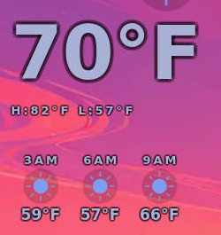

# Fahrenheit Home weather

The physical board runs the rebuilt Rust shell. Its native Home capture shows **70°F**, daily **82°F / 57°F**, and hourly **59°F, 57°F, 66°F**. The same formatter covers fresh and stale snapshots; Celsius source/cache fields are unchanged.

`build.json` records the configured-system cross-build; `activation.log` records the installed profile, actual running executable, both active shell services, successful activation and preserved Chicago timezone. `capture.json` records the native capture, injected Home navigation, source hash, crop and reviewed values. The public crop removes the location and unrelated screen content. The full frame and raw serial transport remain private. This proves rendering on the board, not physical finger interaction or reboot behavior.

Worktree `.scratch/coordinated-work/fahrenheit-weather`, branch `fix/fahrenheit-weather`, base `a549bf24cec137361da9ff45b99f0f0fd4e99ded`; owned paths are the two Rust widget files, this evidence directory, the corresponding OpenSpec change, and this capture's blob-inventory entry. No remaining physical gate is needed for this bounded display-unit change. Integration and Pages publication are tracked in the tasks.
