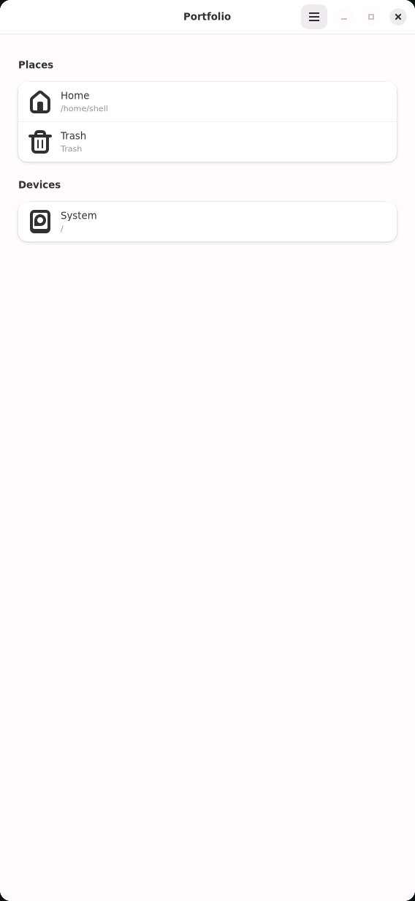
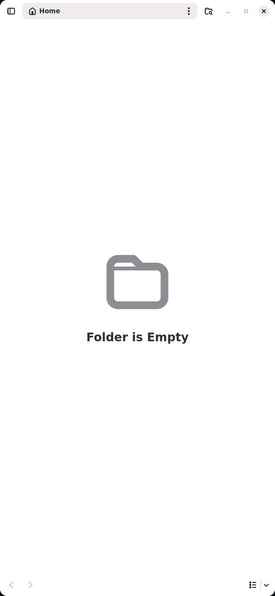
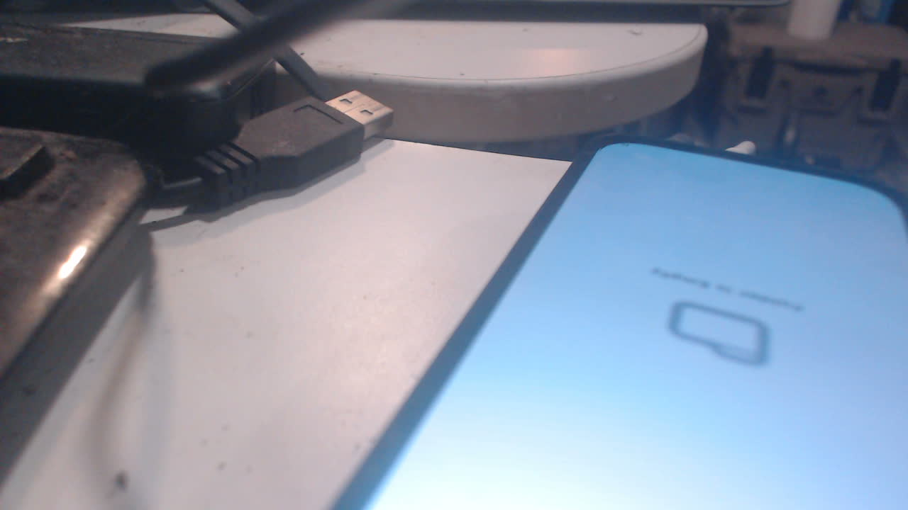

# Files: physical board closeout, 30 September 2026

The operator launched both installed Files entries, confirmed their icons render,
and reported **“files both worked fine for scrolling and such”** after testing
Portfolio and Nautilus on the physical panel. This is real-glass feedback, distinct
from the coordinator's measurements and native screenshots below. Both candidates
remain installed by the already-recorded operator decision.

The coordinator held `/tmp/k230-board.lock` for each serial operation and remained
the sole board operator throughout measurement and collection. The [board script](board-metrics.py)
launches the exact `Exec` executable from each installed desktop override used by
the Rust catalog. It closes candidate windows and terminates a resident Nautilus
process so activation cannot silently reuse an older environment. It measures
monotonic time until the real Sway tree reports each application surface, then
reads application RSS and five narrowly selected environment predicates from
`/proc`. It does not write GTK settings or add icon paths outside the installed
Nix launcher. [Actual results](metrics.json) include exact process and system identities.

| Application | Launch to mapped Wayland surface | Application RSS | Wrapper predicates |
| --- | ---: | ---: | --- |
| Portfolio | 5.916 s | 74,388 KiB (72.6 MiB) | all five pass |
| Nautilus | 3.461 s | 64,536 KiB (63.0 MiB) | all five pass |

Each application's actual process has `GDK_BACKEND=wayland`, `GSK_RENDERER=cairo`,
and application/adwaita/hicolor shares on `XDG_DATA_DIRS`. Both apps render actual
icons in these original board-native captures:







The optical photograph is blurred, oblique and partly outside the frame. It
corroborates that the panel displays the matching empty-folder screen; it does
not establish detailed icon quality or scrolling. Native captures establish
rendered appearance; the operator's report establishes physical scrolling.
[Capture provenance and hashes](capture.json) retain those distinctions.

## Repeatable command and console proof

Stage the committed `board-metrics.py` at `/root/tmp/k230-deployment/files-board-metrics.py`
using `tools/push-file.py`, with the board reservation held, then run:

```sh
flock -n /tmp/k230-board.lock python3 tools/console.py /dev/ttyACM0 --wait=12 'timeout -k 2s 65s /nix/store/v189xydz6qkcd4cbkixcmv91w8hbc560-python3-riscv64-unknown-linux-gnu-3.14.7/bin/python3 /root/tmp/k230-deployment/files-board-metrics.py >/root/tmp/k230-deployment/files-metrics-log.txt 2>&1'
flock -n /tmp/k230-board.lock python3 tools/console.py /dev/ttyACM0 --wait=3 'cat /root/tmp/k230-deployment/files-metrics-result.json'
```

The measurement can outlast the console wait; its protected on-board result and
log persist independently. The [framed collection script](collect-serial.py)
collects that result and original JPEGs after completion, rejecting incomplete
frames and invalid base64. Its host output path is an operator-specific artifact
location and can be changed locally. The [console record](console.txt) contains
only relevant public identities, service health and the successful result.

## Limits and corrected attempts

One sample per app, with already warm OS/library caches. Surface mapping is not
first-frame presentation; RSS covers the app process, not shared D-Bus services
or the entire closure. No scrolling FPS is inferred from the qualitative pass.
The metrics launch the exact installed desktop `Exec` through its wrapper rather
than timing Rust catalog IPC; the operator separately tested drawer launches.

Earlier harness attempts used an unavailable `gio` executable, then the lower
priority upstream desktop entry instead of the catalog's override. A subsequent
run found Nautilus reused an old resident process lacking the wrapper variables;
that result was rejected and the script now requires a fresh process and asserts
all five predicates. Only the successful rerun is accepted here.

Installed userspace is `nlgjhifgwcgg0hlbqhnng7xw7cjgxg9a`, from source
`27110ccb2391100848461a59bccf4bbcd5a59430`. The board's existing boot selection
still names the earlier `x1xbs5qdb5gn91j6s7gsi8mg18qra5ah` system. This closeout
proves the installed Files apps and real-panel behavior, not a new persistent
boot selection. Already-open GTK apps following a subsequent theme change
remain explicitly UNVERIFIED in the spec; no such behavior is claimed here.
