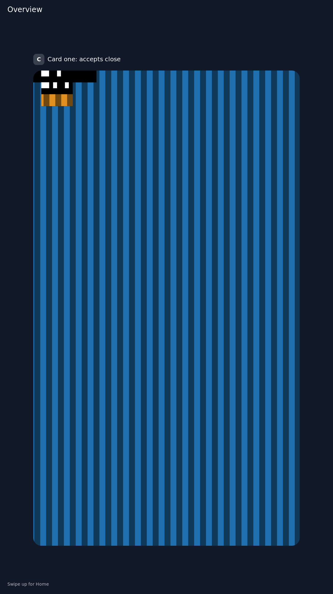

# Real compositor headless scene

The named `tools/hdmi-shell-performance.py --check-scene --variant candidate` dispatcher passes all three variants: 90-degree sampler baseline, 90-degree quarter-turn candidate, and 180-degree sampler fallback. `provenance.json` records the full invocation and artifact identities. The RISC-V Sway/Pixman binary runs under QEMU with a native synthetic changing client; this is **host/headless proof**, not physical HDMI or touch acceptance.

Both parent and desynchronized child buffers receive advancing frame callbacks and releases; ordinary and overview images change. The candidate records its tiled quarter-turn path; 180 degrees records the sampler fallback and retains its documented unsupported card overview. Exact-height injected bottom events are accepted in both 90-degree variants. This does not establish complete pixel parity, RGB565/ARGB coverage, or a board latency budget.

A previous run hit the Unix-domain socket pathname limit at its long evidence path, preventing the 180-degree compositor from starting. The harness now keeps live sockets in a short `~/tmp` directory and retains evidence at the requested output path. The fixed dispatcher run passes; this was a harness startup failure, not measured renderer performance. Public Sway logs omit the host PATH and preload/library environment lines; original/public hashes and filtering are recorded in `provenance.json`.
