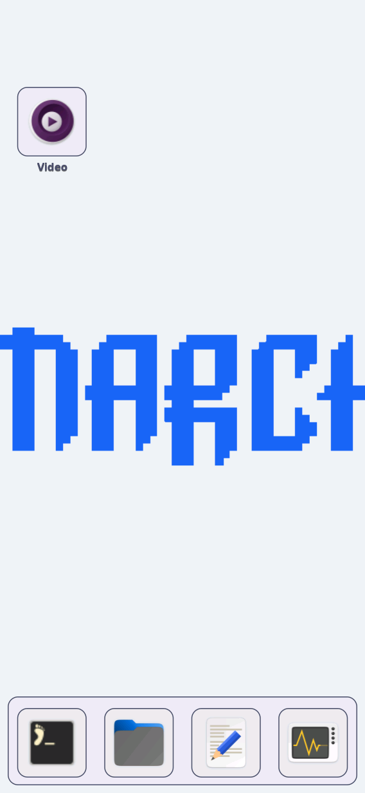
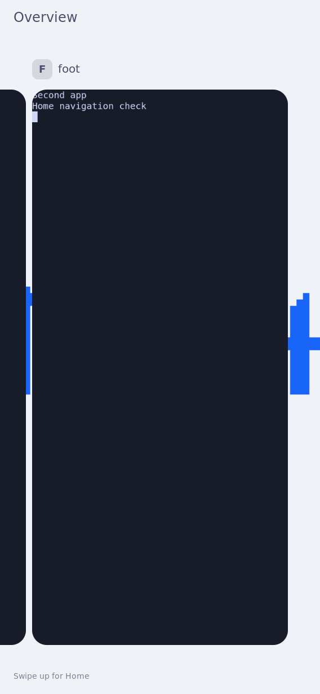
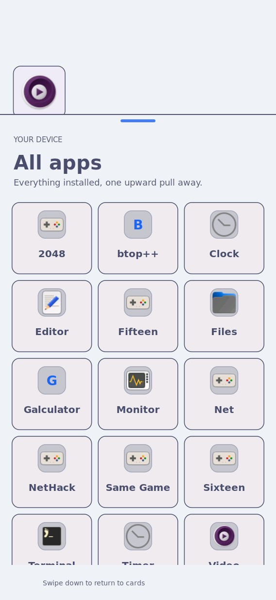
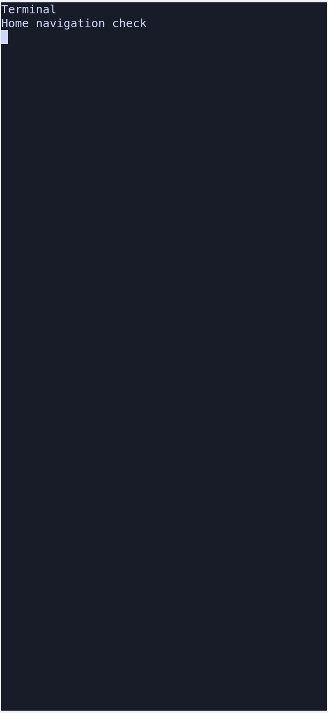

# Overview → Home → App drawer

The user's navigation sequence is implemented in source `f39cb7eb`:
start an upward swipe in the bottom navigation area of the windows list to
reveal the pinned Home screen, then make a separate upward bottom-edge swipe
to open the app drawer. Running windows keep their IDs and workspace placement.
A swipe on an individual card still uses the existing app-close gesture.

The compositor translates Overview one pixel per held input pixel, then eases
to Home or returns to Overview after a cancelled swipe. Home hides app scene
groups; it does not park apps in a scratchpad, move workspaces or close them.
App focus restores those groups. Home's app lookup now recognizes Sway's
`floating_con` type and the `StartupWMClass` declared by our themed terminal
entries, so tapping an icon can return to its existing window.

## Commands

```sh
python3 -m unittest tests.test_card_shell_route tests.test_card_shell_state
cargo test --offline --manifest-path nix/rust-shell-client/Cargo.toml --lib home_screen
cargo test --offline --manifest-path nix/rust-shell-client/Cargo.toml --bin k230-shell-rust running_con_id_honors_startup_class_for_floating_apps
nix build .#nixosConfigurations.k230-coherent-shell.config.system.build.toplevel --cores 6 --no-link
```

The host checks passed: 37 route/policy checks, 20 Rust Home tests, and the
startup-class regression. The separate real-compositor Home-layer self-heal
regression also passed. `tests/rust_home_screen_qemu.py --client <native-probe>`
adds navigation to the existing paired Home fixture; all 24 checks passed
with the exact candidate RISC-V compositor and Rust executables.
`qemu-result.json` records the checks and identities; `qemu-command.json`
records the arguments. The test covers the new navigation, held displacement,
short/reversed/multitouch cancellation, existing/new app focus, and the earlier
paging, pinning, rearranging and helper-restart behavior.

## Evidence limits

Injected QEMU input, injected input on the physical board, and real-finger
acceptance are separate evidence classes. The broad Home readability,
long-press and real-glass acceptance task 8.1 remains open.

## Physical-board navigation

The guarded trial passed on 2026-09-27 UTC. `result.json` records all three
window IDs before and after, seven passed interaction observations, and a
160.2-pixel compositor displacement for a requested 160-pixel held drag.
The captures were reviewed and contain only the navigation fixture and shell.






`board-navigation-check.py` is the exact board workload. Stage it beside
`../../theme-picker/finger-tracking/k230-picker-baseline.py`, named `touch.py`,
in `/run/k230-home-navigation-install-control/`; create the verified virtual
touchscreen using `evemu-device`, then run the workload as root with arguments
`SYSTEM PROTECTED_UPLOAD_URL`. The trial used the Python path in `runtime.json`
under a systemd Type=exec unit bounded to 120 seconds. The upload endpoint and
console transcripts stay in protected runtime files and are not repository assets.
It opened two clean Foot fixture windows, preserved the existing terminal,
and left Home visible after the round trip. No existing app was closed.

The candidate is `/nix/store/514nic5my8069ddwmn4b5mrnm73kqqz8-nixos-system-nixos-26.11.20260919.20b1ddd`.
`runtime.json` records its actual Sway/Rust executables and four healthy shell
services; `manifest.json` records the source, previous system, transfer size
and boot-bundle checks. The kernel and initrd payload remain unchanged.

The previous background-picker image was first normally rebooted and verified
as both running and booted before this trial. Earlier QEMU attempts uncovered
the floating-window/desktop-ID lookup defect and a first-buffer setup race;
those failures were corrected before the final paired run. An overlapping
serial status query failed after the successful trial; it is not part of the
proof, and subsequent console operations were serialized.

## Persistent installation

The qualified image is running and selected in the system profile and boot
bundle. `persist-result.json` records SUCCESS from the unchanged guarded
`../../theme-picker/finger-tracking/persist-userspace.sh` helper; the unique
transaction is `/var/lib/k230/home-navigation-persist-20260927/home-navigation-transaction`.
`persist-verified.json` independently confirms service exit 0, the durable
success record, candidate boot hashes, unchanged firmware/selectors, the
installed system profile and sync. No full-card readback was performed.
A normal reboot into this new image has not been performed; this boot began
with the previous image. The board is left on Home for real-finger testing.

## Change ownership

Worktree `k230-home-navigation`, branch `fix/home-navigation`, base
`e37dc2243afb38014663fd8c9ed73a03d27f319c`; implementation `f39cb7eb`.
Owned paths are the card-shell adapter/header/Sway patch, Rust Home app lookup,
focused route/Home tests, this Home OpenSpec change, this evidence directory,
and the screenshot inventory. The single board/serial reservation covers this
trial and installation only. The remaining acceptance gate is task 8.1's
physical-finger/readability review; this change is not archived.
