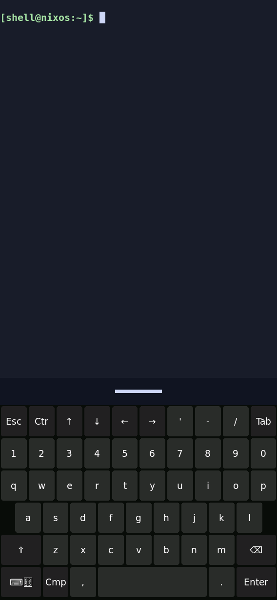

# Installed supervised keyboard and visible handle

Observed 2026-09-24 UTC on the physical board. Source `dcfbdb0b` passed
`nix build .#nixosConfigurations.k230-coherent-shell.config.system.build.toplevel --max-jobs 1 --cores 4 --no-link --print-out-paths`.
Exact system, running binaries and recovery outcomes are in [installed.json](installed.json).
The production keyboard is 400 px high; the earlier QEMU fixture uses 420 px.

Under the exclusive board/serial reservation, 23 additional store paths
(7,268,568 NAR bytes) imported with exit 0. A five-minute rollback timer was
armed against the previous test system, then the new system's
`bin/switch-to-configuration test` exited 0. `readlink -f /run/current-system`,
`/proc/PID/exe` and `systemctl is-active` confirmed the exact system, Sway,
Rust shell, keyboard and all seven services listed in the JSON record.

Installed recovery was tested with
`systemctl kill --kill-whom=main --signal=SIGTERM shell-keyboard`.
After five seconds, the main PID differed, the unit was active, `NRestarts`
was 1, and the running wvkbd binary belonged to
`/system.slice/shell-keyboard.service`. The restarted keyboard was shown with
`runuser -u shell -- pkill -USR2 -x wvkbd-mobintl`.
This proves automatic recovery after process termination; it does not prove
physical output disconnection/reconnection or a finger gesture.



This unedited 568×1232 native board capture used installed `grim` against the
active Wayland display and was visually inspected. It shows the board's
compositor pixels, not a camera view. Keyboard reveal was signalled by command.
The capture command inside `runuser -u shell -- sh -c` was:

```sh
cd /home/shell
export XDG_RUNTIME_DIR=/run/shell
export WAYLAND_DISPLAY=$(basename "$(find /run/shell -maxdepth 1 -type s -name 'wayland-*' | head -1)")
/nix/store/hjllbawb3xs65bmcnyy66yf6g9hdaxk8-grim-riscv64-unknown-linux-gnu-1.5.0/bin/grim /run/shell/coherent-fit.png
```

The resulting PNG was transferred over the reserved console using base64
and committed unchanged as `keyboard-shown.png`.
The foreground-colored grip is visible above the keyboard. No injected touch
or real finger was used for this record. Raw serial logs remain private.

After checking the capture and recovery, the rollback timer was stopped.
Its inactive state, retained candidate identity and active shell/UI/keyboard
services were confirmed. Board and serial reservations were released.
Real-finger show, typing, tracking, reversal, dismissal and motion budgets
remain open. No reboot, flashing or persistent boot selection occurred.
The earlier coherent SD image does not contain this followup. A manual session
rollback uses `previous_test_system` from the JSON record followed by
`/bin/switch-to-configuration test`; reboot retains the earlier boot selection.
