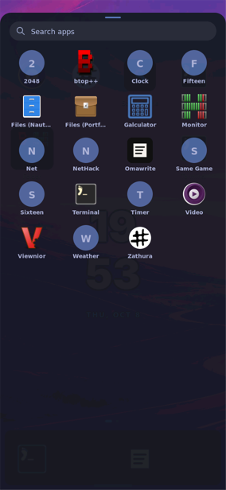

# Curated Apps drawer: board acceptance (task 2.2)

2026-10-08, America/Chicago. Evidence classes: **operator real-finger report**
(in place of a camera capture, at the operator's request: "don't worry about
capture just trust me"), **native `grim` capture**, and shell-log corroboration.
System: installed mainline coherent shell `kp6ldmdx…`, shell executable
`q2rxmp98…-k230-shell-rust`.

## Apps discovery

Operator: Terminal reads as Terminal (not as a Foot endpoint), and "i dont
see foot client in the app drawer". The drawer (the coherent shell's only
All Apps surface, opened by swiping up from Home) was captured natively at
half scale after `k230-shell-rust --surface drawer`:

Visible entries: 2048, btop++, Clock, Fifteen, Files (Nautilus), Files
(Portfolio), Galculator, Monitor, Net, NetHack, Omawrite, Same Game, Sixteen,
Terminal, Timer, Video, Viewnior, Weather, Zathura. Foot Client and Foot
Server are absent. Foot is presented as Terminal and Htop as Monitor. On the
coherent shell this curation comes from `nix/handheld-desktop-entries.nix`
(`NoDisplay=true` overrides and renamed entries). The C `touch-launcher`
policy in `nix/touch-launcher/catalog.c` (host-tested in `host.md`) is the old
bar session's equivalent. Tiles show names only, not a short description.

## Failed launch

A temporary entry "Broken Test" (`Exec=false`) was added to
`/home/shell/.local/share/applications/` and removed afterwards. Asked to tap
it, confirm a human message with no raw path, and tap Back, the operator
replied "worked." `journalctl -u shell-ui` logged `app-launch-requested` and
then `app-launch-process-exited` at 16:36:16. That is the shell's "Couldn't
open <Name>" failure path (`render.rs` `SplashStatus::Failed`).
