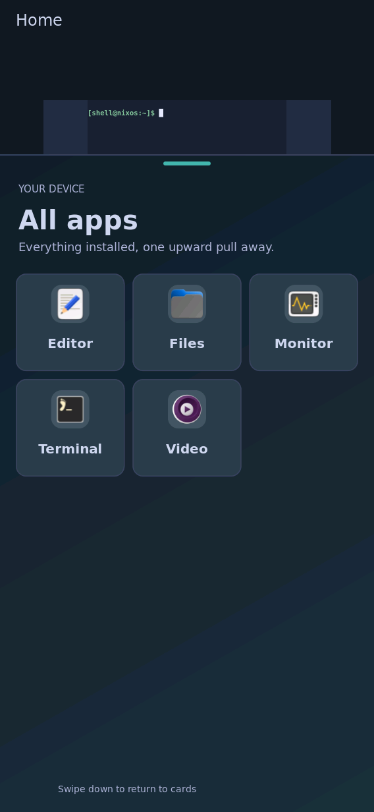
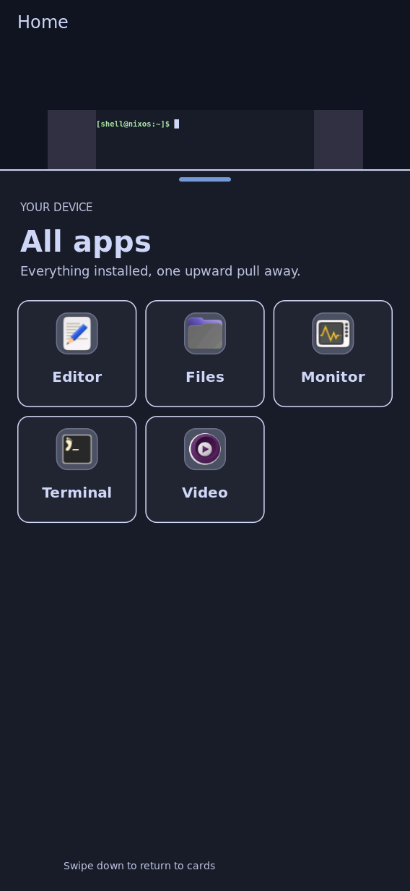

# Theme activation works on the board after the commit fix

Observed 2026-09-24 about 22:40 UTC. **Evidence class:** installed system,
plus native board captures (`grim` on the real compositor, sent back over the
reserved serial console as base64). The theme commands were run as the shell
user. No camera was used and nothing was touched by a finger.

- **Installed system:** `/nix/store/hyjaby3yl151rpxwkanalnl554psi4s8-nixos-system-nixos-26.11.20260919.20b1ddd`,
  built from `master` `cd36242b` with
  `nix build .#nixosConfigurations.k230-coherent-shell.config.system.build.toplevel --max-jobs 1 --cores 6`.
- **Installation:** 15 new store paths (4.9 MB) were imported, and a 5-minute
  rollback timer was armed before running `switch-to-configuration test`.
  Activation exited 0, and `shell`, `shell-keyboard` and the Rust UI were
  active. The rollback timer was stopped once the native frame matched the
  prior healthy capture. Boot files are unchanged.
- **Theme command:** `/nix/store/dv5kism8xharcbmxywb3q65m6karr5cd-handheld-theme-command-0.1/bin/k230-theme`.

## Before this fix

On `k8fjr2hs…`, `8smsfp4r…` and `agcr8mk7…`, every
`k230-theme activate --expected-generation <g> <id>` returned
`commit failed and fanout rollback was not acknowledged`. This happened from
a pointer-less (packaged default) state, with a maximized opaque terminal on
screen. Tracing the transaction showed that the Rust shell explicitly
rejected the commit, and then the rollback to the default. Two causes were
fixed:

- `cee9b769`: the receiver invalidated an in-progress ack when its peer
  deadline passed.
- `cd36242b`: the Rust shell gated the wallpaper redraw on its own frame
  callback, which never arrives while an opaque app hides the wallpaper, so
  every commit waited out its ready timeout.

`b13c0592` also raised the Python exchange budget from 2 s to 8 s, because
one phase takes about 3 s on the K230.

## Result

Each activation ran preview, then `activate --json --expected-generation`:

| From | To | Wall time | Result |
| --- | --- | ---: | --- |
| no active pointer (packaged default) | catppuccin | 4614 ms | activated |
| catppuccin | catppuccin-latte | 3705 ms | activated |
| catppuccin-latte | community-proof (unchanged Fuchsblau clone, user theme) | 5008 ms | activated |
| community-proof | catppuccin | — | activated (`{"activated": true}`) |

`journalctl -u shell-ui` showed **zero** `appearance-*-failed` or
`appearance-*-rejected` lines across the run.

 

The drawer was opened with `k230-shell-rust --surface drawer`. In the
community capture, the drawer shows the theme's diagonal launcher gradient and
teal cue. In the catppuccin capture, the cue is blue, the tiles have lavender
outlines, and the Files icon changes to its purple variant, so theme,
background layer and icon selection all switched together. For attribution of
the community theme, see `../community-board-fixed/THEME-LICENSE.txt`. Only
its rendered appearance is shown here.

## Limits

This was not a real-finger chooser interaction; the carousel's Apply button
wasn't pressed on glass. No per-frame timing was recorded. Each switch takes
4–5 s, mostly decoding full-size photo backgrounds on the K230, which is a
known follow-up. Persistence across a reboot was not tested here, and
real-finger acceptance stays pending.
