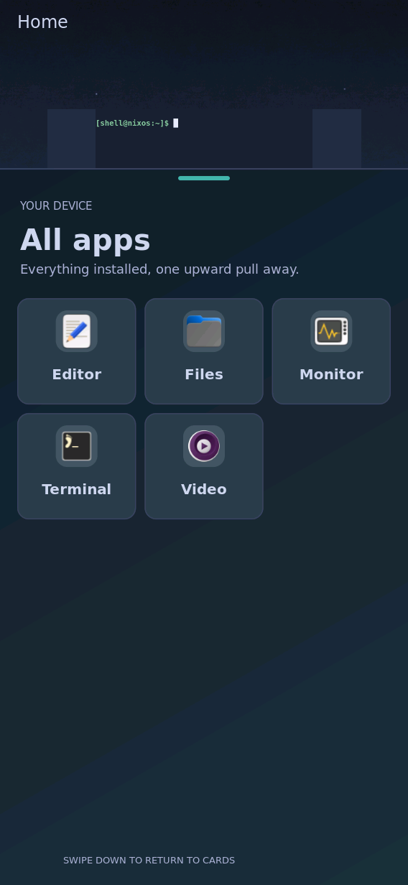

# Unchanged community theme now activates on the board

Observed 2026-09-24 UTC. The [installed identity](installed.json) pins source
`3c502a37`, its full-system derivation and running binaries. The exact build
passed:

```sh
nix build .#nixosConfigurations.k230-coherent-shell.config.system.build.toplevel --max-jobs 1 --cores 4 --no-link --print-out-paths
```

The community parser correction and portrait wallpaper preview are included.
Later notification gesture commits are not part of this installed build.
Fifteen additional store paths (4,705,184 NAR bytes) imported with exit 0.
A five-minute system rollback timer targeted the prior `48x70…` preview;
`switch-to-configuration test` exited 0 and all seven services became active.
The first check during activation saw services still stopped; the final check
recorded completion and all running identities before beginning the trial.

[The failed trial](../community-board/README.md) remains intact. This repeat
uses the same unchanged Fuchsblau checkout at public commit
`aa7fde043ae60603c3ecc6fd6ac3b6674cacab04`; its content digest before and after
is the identical value in `installed.json`. Its three backgrounds and section
overrides were used directly, with generated files outside the clone.

The actual command, as shell user with the active `WAYLAND_DISPLAY`, was:

```sh
XDG_RUNTIME_DIR=/run/shell \
PYTHONPATH=/nix/store/wz5m2pb3300zhand0z0r4nx519hzh2is-handheld-theme-command-0.1/libexec/handheld-theme \
/nix/store/v189xydz6qkcd4cbkixcmv91w8hbc560-python3-riscv64-unknown-linux-gnu-3.14.7/bin/python3 \
  /run/shell/community-fixed-tools/handheld-theme-trial.py \
  --candidate-manifest /run/shell/community-fixed-tools/candidate.json \
  --output /run/shell/theme-community-fixed-evidence \
  --raw-private-dir /run/shell/k230-theme-community-fixed
```

The private manifest pinned the installed system and all commands, both shell
appearance sockets, and the unchanged shared static-workload checklist. The
[result](result.json) records three successful arms: bundled dark, bundled
light and community. Each preview was activated with its exact generation,
confirmed by the active catalog, captured and reported app appearance applied.
The helper exited 0 and restoration passed; baseline/restored native pixels
were byte-identical. This establishes coordinated activation and static
restoration, not execution of the checklist’s finger/performance steps.



The unedited 568×1232 screenshot shows the real board compositor: community
wallpaper, authored diagonal launcher gradient, teal cue, card colors and app
icons. The same installed `grim` used by the prior trial wrote
`/run/shell/k230-theme-community-fixed/community.png`; it was transferred over
the reserved console with base64 and visually reviewed. Restored capture was
also reviewed and matches the earlier dark capture’s SHA-256; no duplicate
is committed. The JSON’s automatic `native-unreviewed` tag describes collection,
while this manual review is separate. No camera or real finger input was used.

Theme attribution: Fuchsblau by Matthias Nitsch, repository MIT license copied
as [THEME-LICENSE.txt](THEME-LICENSE.txt). At the pinned revision, the upstream
`docs/briefing-fuchslicht-serie.md` documents the generated fuchslicht background
series and its intended MIT repository compatibility. This screenshot includes
only the selected source’s rendered appearance; the full theme assets are not
vendored into this repository or added to the default image.

After the reviewed captures, the rollback timer was stopped and its inactive
state plus retained system identity and active shell/UI/keyboard were checked.
The original theme was restored, the drawer hidden, the terminal returned,
and keyboard shown by USR2. Board and serial were released. The checkout stays
available in the user theme catalog. No boot files/profile were changed.
Manual rollback is `previous_test_system` plus `/bin/switch-to-configuration test`.
The earlier host SD image still names `48x70…` and is not this updated system.

Remaining gates include full corresponding-role coverage, real-finger chooser
interaction, appearance performance, video wallpaper and reboot persistence.
Neither this successful static trial nor the host parser tests closes them.
