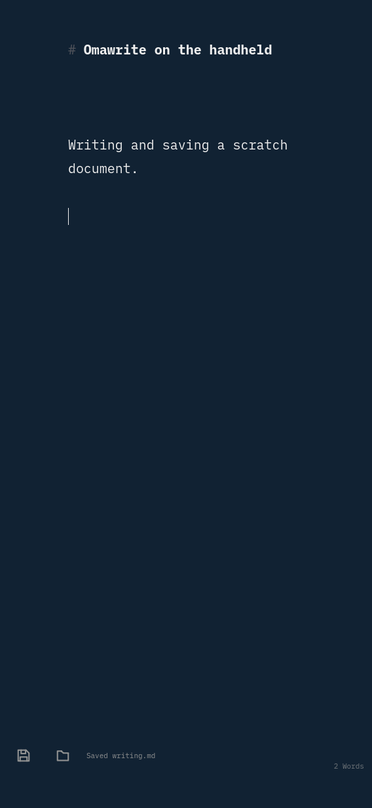
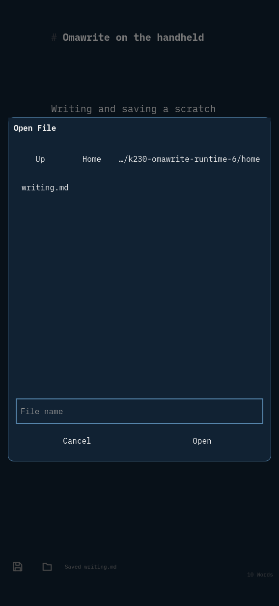
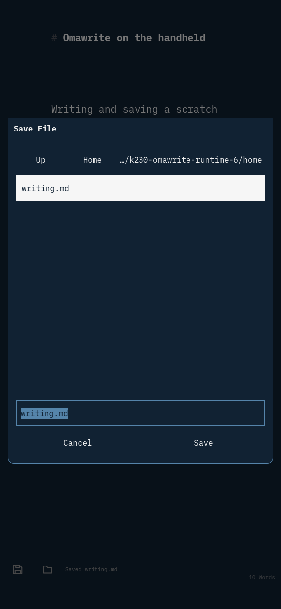
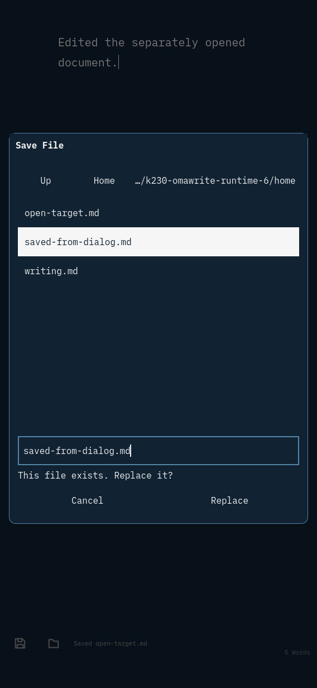
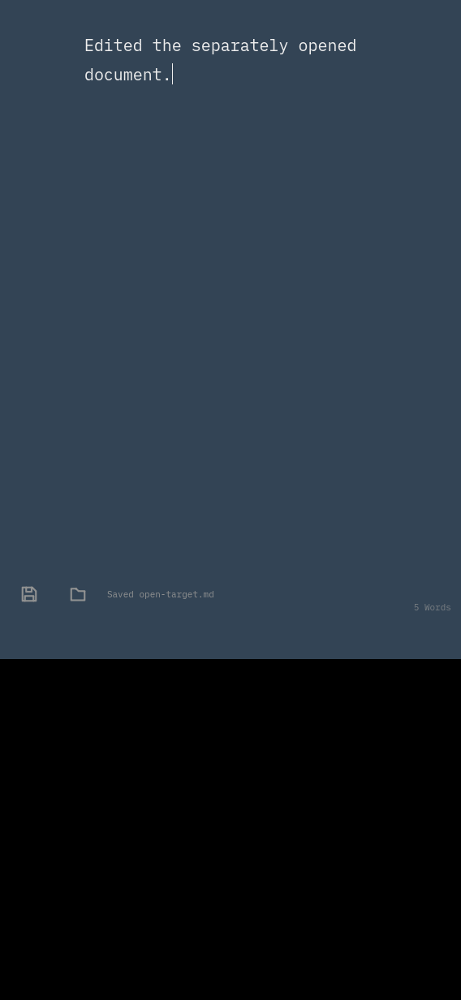
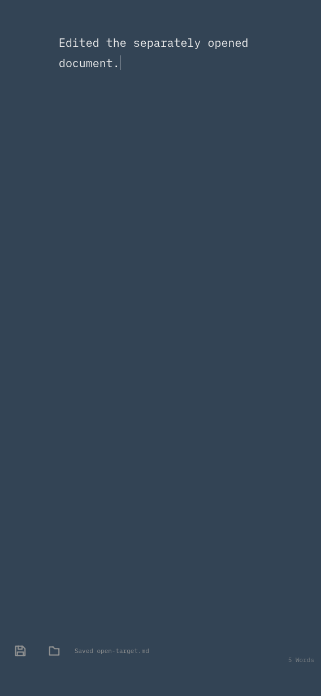

# Omawrite as the graphical editor

**Host runtime passes; the RISC-V package/system build and physical-board
trial are pending. This is not a shipped-device claim.**

The existing `k230-editor.desktop` identity is retained, with the name
Omawrite, its upstream icon and Wayland app ID. The source change makes it
the graphical plain-text/Markdown handler; Nano stays available on the console.

Upstream: [omacom/omawrite](https://github.com/omacom/omawrite), revision
`8f98892b26768236b2c20f4e637cf4b102d898bf`. The package pins the source hash
and installs its MIT and font OFL notices. The image uses Wayland and Qt Quick
software rendering, a portrait-sized chooser and 48px Open/Save targets above
the bottom gesture strip. The upstream palette watcher follows the shell's
`current/active` generation.

## Host runtime — 2026-09-27

The actual native Omawrite application ran under the existing RISC-V Sway
through host binfmt/QEMU, with a private HOME, a 568x1232 headless output,
synthetic Wayland keyboard input, and native Wayland captures. The app reported
`omawrite renderer=software platform=wayland`.

```sh
nix build --impure --expr 'let f = builtins.getFlake (toString ./.); in f.inputs.nixpkgs.legacyPackages.x86_64-linux.callPackage ./nix/omawrite { }' \
  --cores 2 --no-link --print-out-paths
python3 tests/omawrite_runtime.py \
  --sway /nix/store/0a2f857nc1rz65gnjdfn46h32zsyxm18-sway-unwrapped-riscv64-unknown-linux-gnu-1.12/bin/sway \
  --omawrite /nix/store/0i70ycyrx2ivga98gdh76ckwmf5wa09z-omawrite-0-unstable-2026-08-07/bin/omawrite \
  --output /tmp/k230-omawrite-runtime-6
```

[Machine result](host/result.json) records nine checks: portrait launch,
edit/save, chooser save-as/open of a different file, overwrite cancellation,
dialog cancellation preserving edits, live theme generation change,
keyboard-sized window, reopening the saved document and the software backend.
The keyboard-sized check resizes to 568x812; it does **not** exercise the
board's on-screen keyboard. Initial stock-dialog and Material-style failures
were caught by screenshot review; the final controls use the Basic style.
No frame-rate or physical-touch claim follows from these checks.









## Remaining device gate

Finish the RISC-V app and coherent-system builds, then reserve the board and
trial scratch-file editing, Open/Save, the real keyboard surface, Overview and
Home. The operator must have exclusive use: during the initial read-only check,
the running system differed from the saved boot target, so device mutation was
held pending coordination. No board app or persistent-system change has been
made for Omawrite yet.
