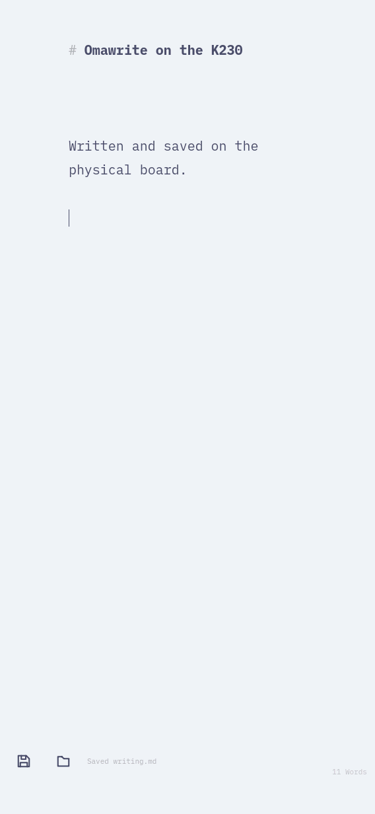
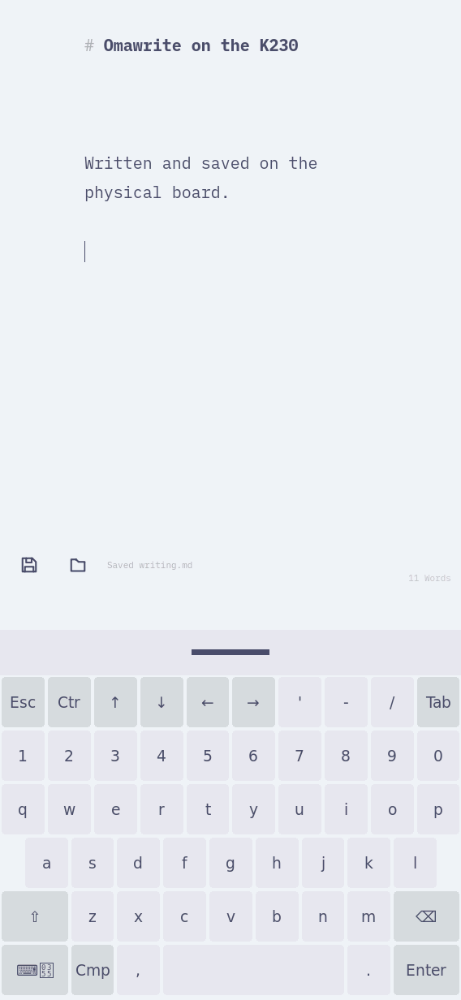
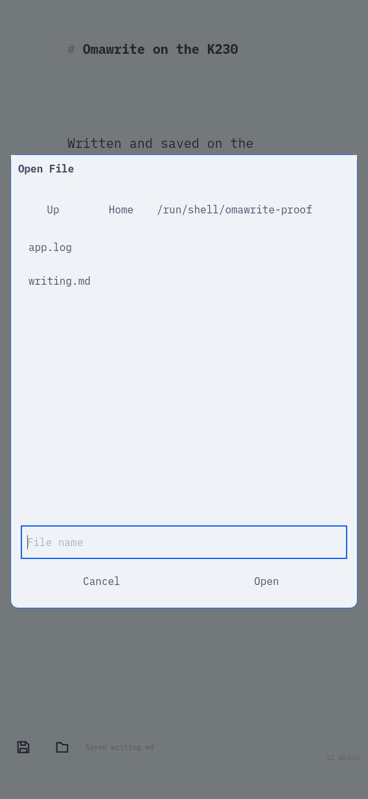
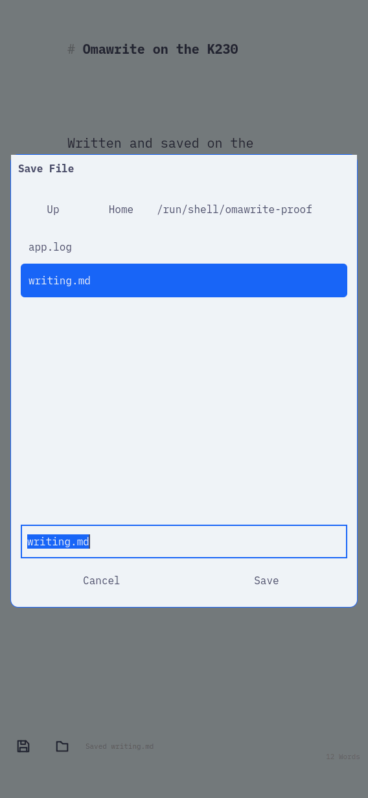
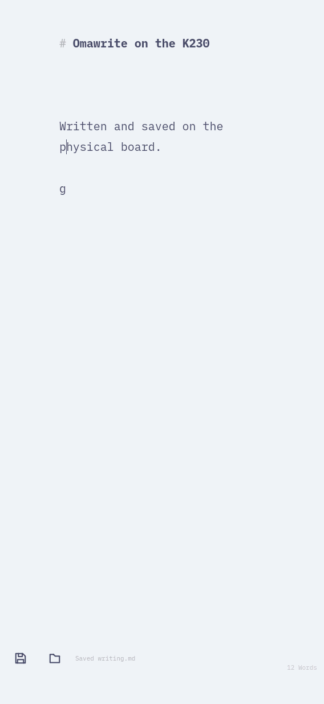
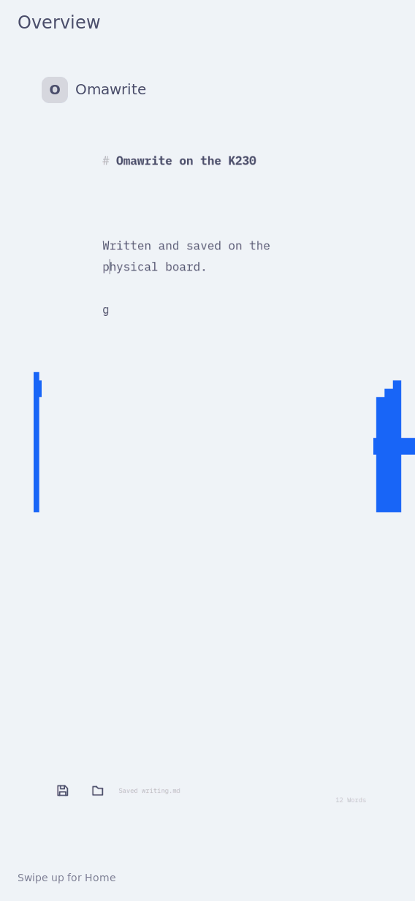
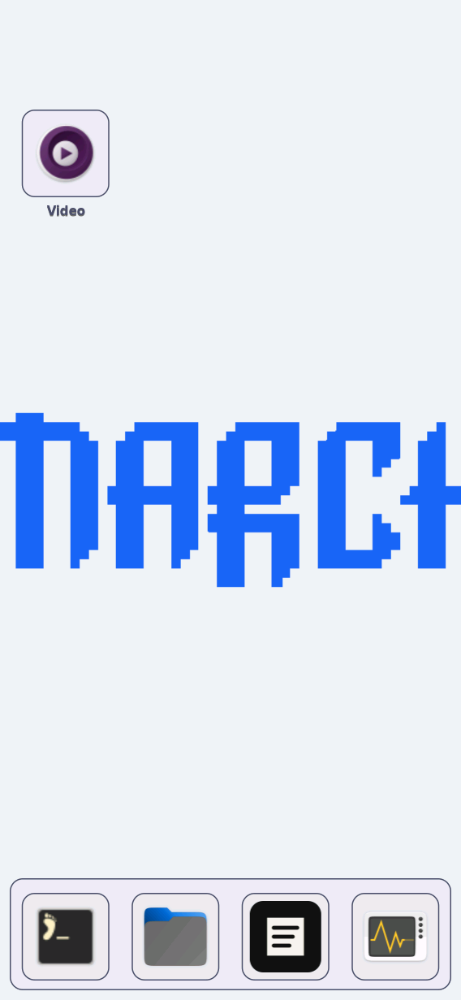
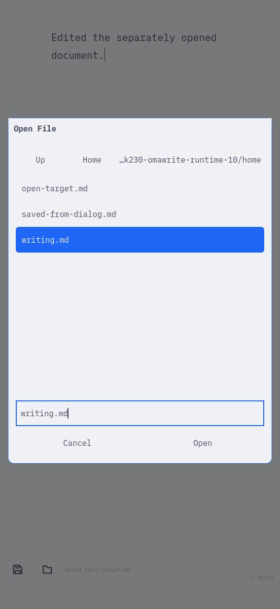

# Omawrite as the graphical editor

**Installation trial passed; the replacement card booted, with actual launcher verification pending.**

The user subsequently reported failed editor launches and missing application
icons. The console confirmed SD read failures, a read-only root filesystem,
and executables failing with input/output errors. See the
[storage recovery record](storage-recovery/README.md) for current status.
The installation and reboot results below are historical trial evidence.

Omawrite replaces the graphical Editor while retaining `k230-editor.desktop`,
so existing Home pins keep working. The image includes its upstream icon,
plain-text/Markdown defaults and XDG file-opening utilities. Nano remains
available for console work. This is image configuration, not a user-profile
installation.



## Exact artifacts

- Application: `/nix/store/nvnmlbqxh4m5kgw1qa4aj20r6vw1w4xm-omawrite-riscv64-unknown-linux-gnu-0-unstable-2026-08-07`.
- Installed system: `/nix/store/cmhsqwvzwp3bad15wv5znk4w35wx65d5-nixos-system-nixos-26.11.20260919.20b1ddd`.
- Application/system source: `4db47bc0117378efa120c17679a1cea8d506949e`.
- [RISC-V architecture and closure result](package-result.json).
- [Image integration result](image-result.json).
- [Physical-board result](board/result.json).
- [Boot bundle manifest](board/install-manifest.json) and
  [persistent transaction](board/persist-result.json),
  [saved-file verification](board/persist-verified.json), and
  [normal reboot result](board/boot-result.json).

Upstream [omacom/omawrite](https://github.com/omacom/omawrite) is pinned to
`8f98892b26768236b2c20f4e637cf4b102d898bf`, with its source hash in the Nix
package. MIT and embedded-font SIL OFL notices ship in the package. The native
and cross builds compile source; no prebuilt editor binary is imported.

```sh
nix build .#omawrite --cores 6 --no-link --print-out-paths
nix build .#nixosConfigurations.k230-coherent-shell.config.system.build.toplevel \
  --cores 6 --no-link --print-out-paths
```

The narrow package output and image use exactly the same application closure.
The pinned Qt package needed corrected host QML/Quick/shader-tool paths for
cross compilation. `FEATURE_quick=ON` makes missing Quick support fail explicitly.
The image checks cover the preserved desktop ID, installed icon, MIME defaults,
retained Nano and absence of a duplicate visible Omawrite entry.

## Physical-board trial — 2026-09-27

The actual RISC-V application ran on the reserved K230, with native 568x1232
RGB565 output. [The trial](board-trial.py) uses a private scratch HOME and an
explicit current-system desktop environment. It imports `WriterKeyboard` from
`tests/omawrite_runtime.py`, `tests/card_virtual_keyboard.py`, and the existing
injected-touch helper at
`docs/evidence/theme-picker/finger-tracking/k230-picker-baseline.py` (staged as
`writer.py`, `card_virtual_keyboard.py`, and `touch.py` alongside the trial).

The board operator held `/tmp/k230-board.lock` and `/dev/ttyACM0` at 115200.
The expanded trial command was run through `tools/console.py`; only the private
upload endpoint remains a protected runtime value:

```sh
systemd-run --unit=k230-omawrite-install-inspect-v3 \
  --property=Type=exec --property=RuntimeMaxSec=180s \
  --setenv=PATH=/run/current-system/sw/bin:/run/wrappers/bin \
  /nix/store/v189xydz6qkcd4cbkixcmv91w8hbc560-python3-riscv64-unknown-linux-gnu-3.14.7/bin/python3 \
  /run/k230-omawrite-install-control/trial.py \
  /nix/store/cmhsqwvzwp3bad15wv5znk4w35wx65d5-nixos-system-nixos-26.11.20260919.20b1ddd "$PRIVATE_UPLOAD_BASE"
```

Twelve checks pass: default Markdown handler; software Wayland backend;
scratch edit/save; a real wvkbd key activated through injected touch; keyboard
show/hide resize; native Open control; Save As; reopening saved text;
Overview/Home return; the existing Editor pin focusing its original window;
the same pin launching a fresh app; and active-theme color in the native capture.
The app reports `omawrite renderer=software platform=wayland`.

The selected theme background is `#eff1f5`. Its RGB565 capture expands to
`(239, 243, 247)`, exactly matching the observed pixel; it is not expected to
retain all eight source bits per channel. The app reads and watches
`~/.local/state/omarchy/current/active/theme/colors.toml`. Review caught and fixed
an initial fallback-palette path and poor light-theme control/selection contrast.
All seven final native captures were visually reviewed.

This is **physical-board execution with injected touch and keyboard input**,
not new real-finger acceptance or a frame-rate benchmark. The result preserves
the board-reported timestamp and host collection timestamp. Only scratch text,
public theme colors and reviewed captures are published.








## Persistence

The existing guarded helper
[`persist-userspace.sh`](../theme-picker/finger-tracking/persist-userspace.sh)
installed this same qualified system. It verified the current/booted/profile
baseline, retained the previous system and boot-file backup, checked the kernel
and initrd relationship, and recorded a durable SUCCESS transaction. The boot
update is not atomic; its rollback protection is described by that helper.

The staged root was `/var/lib/k230/omawrite-persist-20260927-final`. The operator
invocation, after staging and SHA-256 verification, was:

```sh
bash /var/lib/k230/omawrite-persist-20260927-final/persist.sh \
  /nix/store/cmhsqwvzwp3bad15wv5znk4w35wx65d5-nixos-system-nixos-26.11.20260919.20b1ddd \
  /var/lib/k230/omawrite-persist-20260927-final/new \
  /var/lib/k230/omawrite-persist-20260927-final/previous \
  /var/lib/k230/omawrite-persist-20260927-final/omawrite-transaction
```

The four installed boot hashes, four unchanged firmware/selector files, saved
system profile, and healthy shell/UI/keyboard/theme services were verified.
No full-card readback was performed. [Normal reboot verification](board/boot-result.json)
passed: current, booted and saved profile identities match, the four services
are active, and the installed editor executable maps a fresh window. The exact
[boot-check script](board-boot-check.sh) was sent through
`python3 tools/console.py /dev/ttyACM0 --wait=35` as a quoted `bash -c` command.
The verification left a blank Omawrite window open for the user.

## Host runtime

The actual native app ran under RISC-V Sway through host binfmt/QEMU, using a
private HOME, a headless 568x1232 output and synthetic Wayland input. These
results are distinct from the board trial above.

```sh
python3 tests/omawrite_runtime.py \
  --sway /nix/store/0a2f857nc1rz65gnjdfn46h32zsyxm18-sway-unwrapped-riscv64-unknown-linux-gnu-1.12/bin/sway \
  --omawrite /nix/store/j8d4yxkip06wlsd0gh3z5s0zf9yh3sb1-omawrite-0-unstable-2026-08-07/bin/omawrite \
  --output /tmp/k230-omawrite-runtime-10
```

[Host result](host/result.json) covers editing, chooser Save As/Open of a
different document, overwrite cancellation, cancellation preserving edits,
live dark-to-light theme generation changes, a keyboard-sized window, reopening
and actual software-backend identity. Host resizing is not OSK proof; the real
keyboard surface is covered by the board trial.





## Publication

[Delivery record](delivery.json) identifies the implementation commit, successful
CI/Pages run and published URL. The local site build passed at `a7e97de5` with
346 pages, 11,009,538 bytes and 29.41 seconds. The work board discovers all 15
captures and selects physical-board writing as the first image. An existing
VG-Lite test fixture's fake PID collided with a CI process; the isolated test fix
`6e430206` passed a collision reproduction and all 22 tests in its CI group.
CI build and deployment then succeeded, and the published editor evidence was
checked for the matching system path and all 15 images. No device gate remains.
