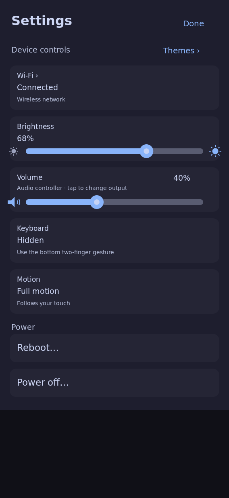
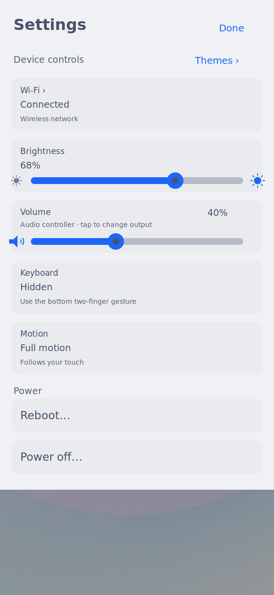

# Settings volume row: separated text and slider

2026-10-01: the live Settings capture in
`docs/evidence/omarchy-themes/settings-notifications-themed/board/dark-settings.png`
shows the output-description line painted across the volume track. The value now
shares the heading line; the output description occupies the middle line and its
tap region moves with it. The slider keeps its existing position. The updated
picker band ends at the slider thumb's upper edge, so dragging the thumb cannot
open the output picker.

`cargo test --offline --manifest-path nix/rust-shell-client/Cargo.toml --lib`
passed: 426 checks, zero failures, one pre-existing ignored timing benchmark.
The existing Settings-only/default-sink hit test was updated to check the moved
text and exclusion of the slider thumb; normal brightness/volume gesture,
Settings/theme paint, and Home/pointer checks remain in that library suite.

The screenshots below are production host renders, **not board captures**.
They use pinned authored Catppuccin and Flexoki Light appearances and synthetic
service values, including one explicitly synthetic Audio controller at 40%.
The existing `render_polish_evidence` example now exercises a present output,
instead of omitting the row's slider behind an unavailable-output state.

```sh
cargo run --offline --manifest-path nix/rust-shell-client/Cargo.toml \
  --example render_polish_evidence -- OUT DARK-GENERATION LIGHT-GENERATION
```

Generation IDs: dark `6ae3582938d6ab4285d9e32d`, light
`bc67f39ac422947f52040a19`. Native dependencies came from the pinned flake's
`nixosConfigurations.k230.pkgs.buildPackages`, source `288535289172c8465c4fa408eaa8ba2c7ab8a5ac`,
with Cargo/Rust, Cairo, Pango, librsvg, GLib and libxkbcommon. The renders and tests
ran against this change's source. No physical taps or audio listening result are
inferred from them. Cross-build and installation are recorded separately when
performed; broader shell-polish real-glass acceptance remains task 6.4.





The matching full system subsequently built and passed native board controls and
dark/light captures: [board qualification](board/README.md). The expected client
is running; original theme and volume are restored. Boot/profile selection is
unchanged and broader real-glass polish acceptance remains open.
