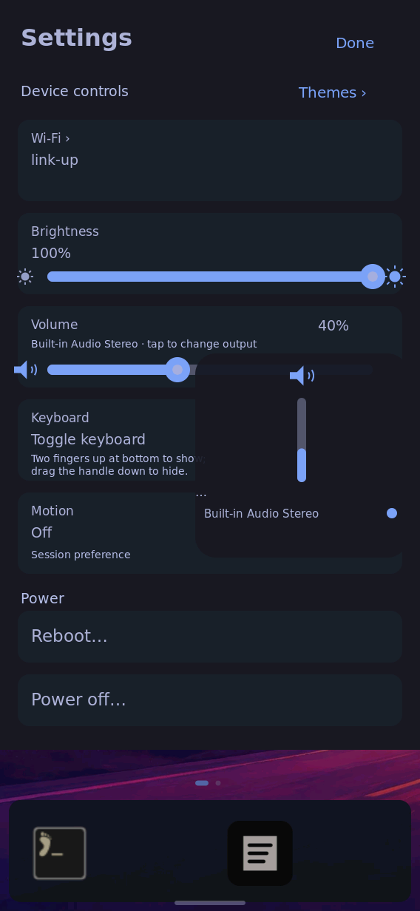
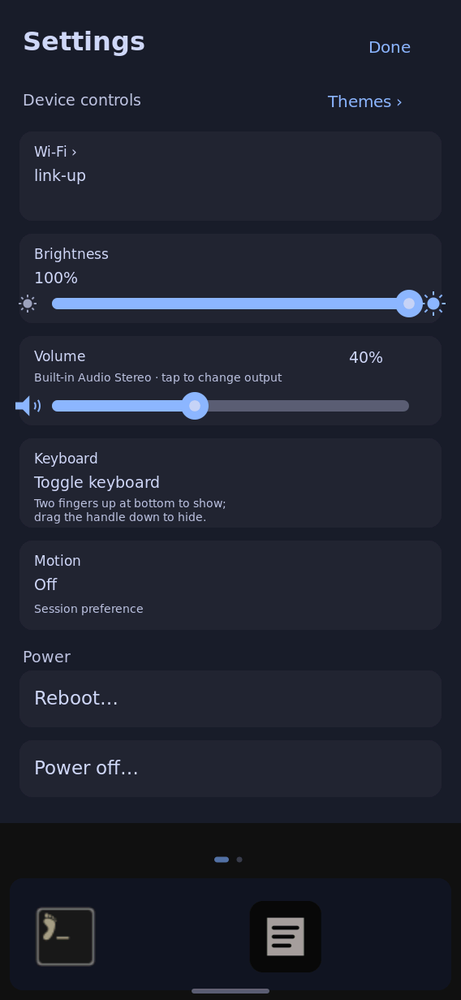
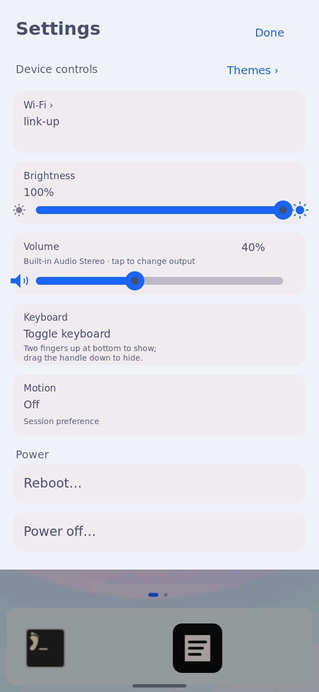

# Physical-board Settings volume-layout qualification

On 2026-10-01 the full coherent system built from source
`5bb67db128210f830dab4de0d20a4b0eca13c578` activated in runtime test mode
and ran the exact new shell executable. [result.json](result.json) records nine
PASS checks, three capture hashes, system/client/helper identities and the
immediate restoration command. [trial.py](trial.py) contains the executed test.

The built system is
`/nix/store/p1a1hz9n8s4g8qyr55ffl3dzbnjgqwr8-nixos-system-nixos-26.11.20260919.20b1ddd`;
its client is
`/nix/store/3hy6h165ii649z6vjzjd36jwg16d37rc-k230-shell-rust-riscv64-unknown-linux-gnu-0.1.0/bin/k230-shell-rust`.
The coordinator built it in the sole build slot with:

```sh
nix build "git+file://$REPO?rev=5bb67db128210f830dab4de0d20a4b0eca13c578#nixosConfigurations.k230-coherent-shell.config.system.build.toplevel" \
  --no-link --print-out-paths --max-jobs 1 --cores 6
```

A protected transport supplied its missing closure registration/store contents,
then root executed the script on the reserved serial console:

```sh
/nix/store/v189xydz6qkcd4cbkixcmv91w8hbc560-python3-riscv64-unknown-linux-gnu-3.14.7/bin/python3 \
  /root/tmp/k230-settings-controls/trial.py PROTECTED_EVIDENCE_ENDPOINT
```

An independent restoration timer was armed before `switch-to-configuration test`.
Configured kernel/initrd/modules matched the baseline. The exact live process
and all three shell/theme services passed inspection. Boot files and the
persistent system profile stayed unchanged. The timer was retired after successful
qualification; the new runtime remains available. This is not ordinary boot or
persistent boot-selection acceptance. Its restoration command is in the result.

The injected Linux uinput touch device uses the established
`K230 Shell Gesture Test Source` identity and logical panel coordinates. Before
tapping, the test checks actual native pixels to establish that the Settings
volume slider is loaded. Tapping `(260,457)` opens the expanded output picker:
its actual region changes and the reviewed capture visibly contains the real
Built-in Audio Stereo output. The volume track at `y=500` changes the actual
PipeWire/WirePlumber sink; its previous level and mute state are restored.
Both real appearance receivers accept dark/light transactions; the original
theme is restored afterward. The final shell, UI and helper services are active.
No headphones or acoustic output were tested.

The captures were privacy-reviewed: network state says only `link-up`; there
are no network names, passwords, addresses or private notification/window text.
They are native board captures with injected touch, not camera photographs or
new real-finger acceptance. Dark uses Catppuccin; light uses Catppuccin Latte.
The host renders in the parent directory use Flexoki Light and synthetic service
values, and remain a separate evidence class. Broader six-surface shell-polish
glass acceptance remains task 6.4.

Earlier harness attempts were corrected without changing the installed source.
The first expected `wpctl` in the system PATH; the test now uses its exact store
path and that failed attempt restored the prior runtime. An early picker capture
caught a transient Settings helper deadline, so a loaded-volume pixel precondition
was added. A later capture read the full journal before saving the short-lived
HUD and missed it. A separate immediate pointer capture showed the picker; moving
the native touch capture ahead of journal I/O then passed the stronger pixel
check. These earlier images are not presented as successful picker evidence.






