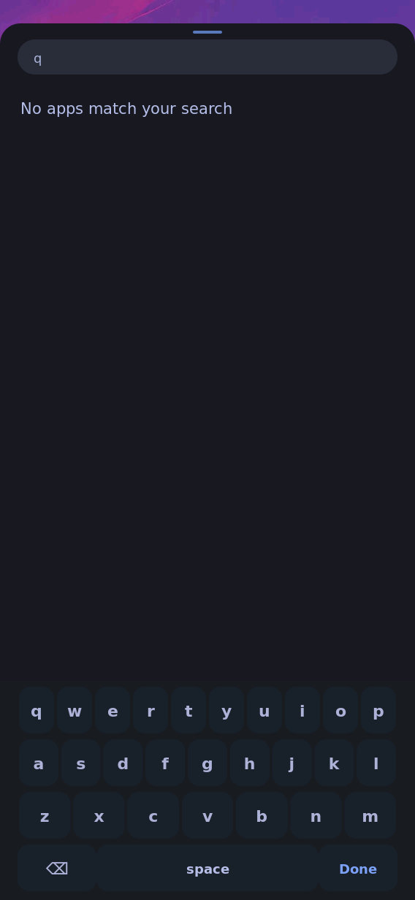
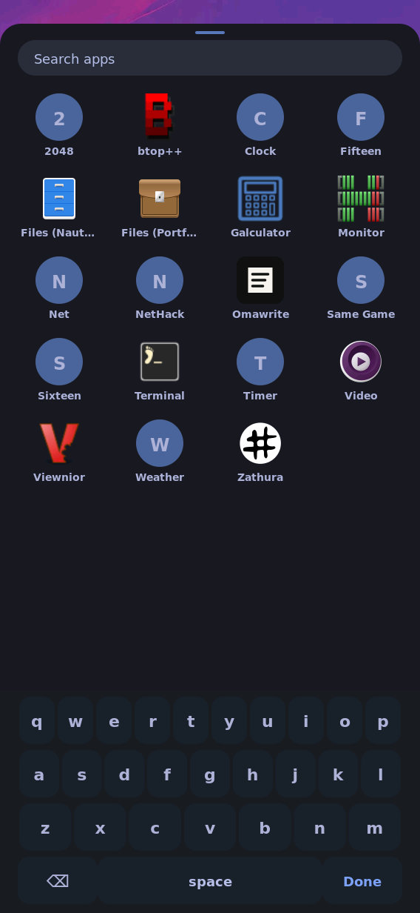
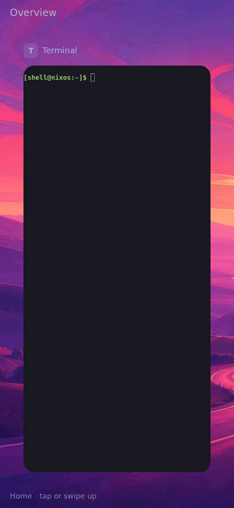
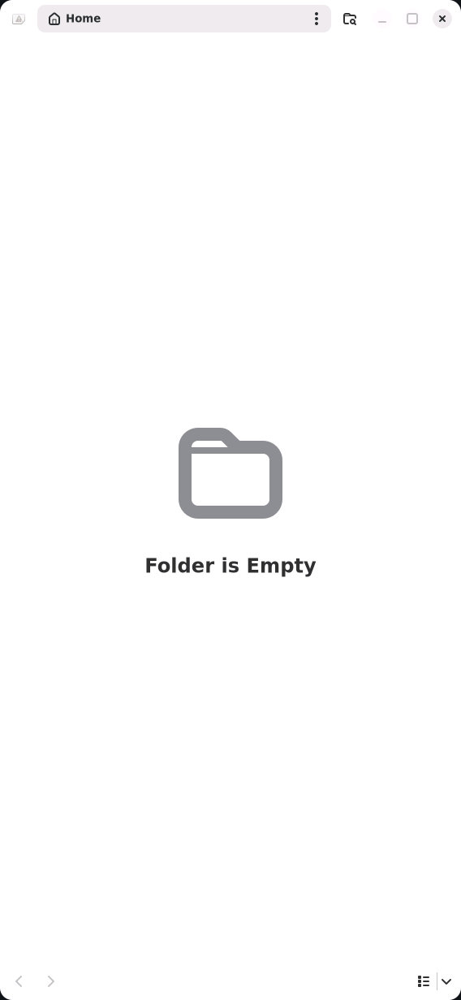
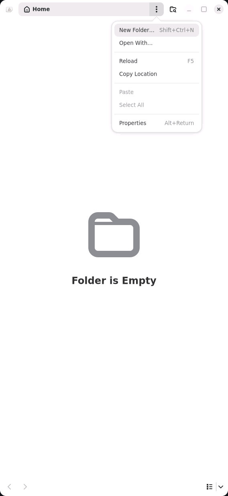

# Edge taps and Home return: installed board proof

Source `27110ccb2391100848461a59bccf4bbcd5a59430` is installed as the exact [userspace and live component identities](installed.txt). The coordinator held `/tmp/k230-board.lock`, imported the 36 missing closure paths with SHA-256 verification, armed an independent seven-minute rollback timer, and switched userspace without flashing, changing the device tree or rebooting. `shell-ui` needed an explicit start after activation; all three shell/input services then reported active. The timer was stopped only after the live native input checks. The board reservation and temporary transfer server were released afterward.

The [repeatable uinput probe](board-uinput-check.py) sends real Linux input-device events from a named synthetic direct-touch device, not IPC gesture shortcuts. Its actual Home bottom-handle tap enters overview. It then opens the actual Rust drawer, taps Search and `q`, and taps Backspace at `(60,1214)`, inside the old stolen bottom edge band. The native images show the query change from `q` to empty, the app grid return, and the drawer staying open.







The [header probe](board-header-check.py), after explicitly focusing the real `org.gnome.Nautilus` window, taps its header menu at `(390,23)`, inside the old stolen top edge band. The native image shows the app menu open; the notification shade did not replace it.





Commands, with the board reservation held (probes staged to the named board paths):

```sh
python3 tools/console.py /dev/ttyACM0 --wait=3 'readlink -f /run/current-system; systemctl is-active shell shell-ui k230-touch-trackpad'
python3 tools/console.py /dev/ttyACM0 --wait=12 'timeout -k 2s 35s /nix/store/v189xydz6qkcd4cbkixcmv91w8hbc560-python3-riscv64-unknown-linux-gnu-3.14.7/bin/python3 /root/tmp/k230-deployment/edge-board-check.py'
python3 tools/console.py /dev/ttyACM0 --wait=4 'runuser -u shell -- env SWAYSOCK=/run/shell/sway-ipc.sock timeout 3s swaymsg -r "[app_id=\"org.gnome.Nautilus\"] focus"; timeout -k 2s 20s /nix/store/v189xydz6qkcd4cbkixcmv91w8hbc560-python3-riscv64-unknown-linux-gnu-3.14.7/bin/python3 /root/tmp/k230-deployment/edge-header-check.py'
```

Original JPEG files were collected with framed serial base64 and inspected visually; [result and hashes](result.json) identify them. An initial unfocused header attempt captured Home and proved no app-control behavior; only the focused rerun is accepted. An overlapping coordinator serial read interrupted the first console wrapper; the independent completed board result and fresh single-reader health query were collected afterward. No failed wrapper is presented as successful console evidence.

This completes deployment/simulated-controls task 4.2. Task 4.3 still requires actual fingers: app header controls, compact search Backspace, Home handle, and top/bottom drags. The original HDMI pointer/four-finger acceptance gate 3.3 remains open. Normal `/boot` selection still points at the earlier x1xbs5qd system; this userspace switch is not persistent-boot proof.
