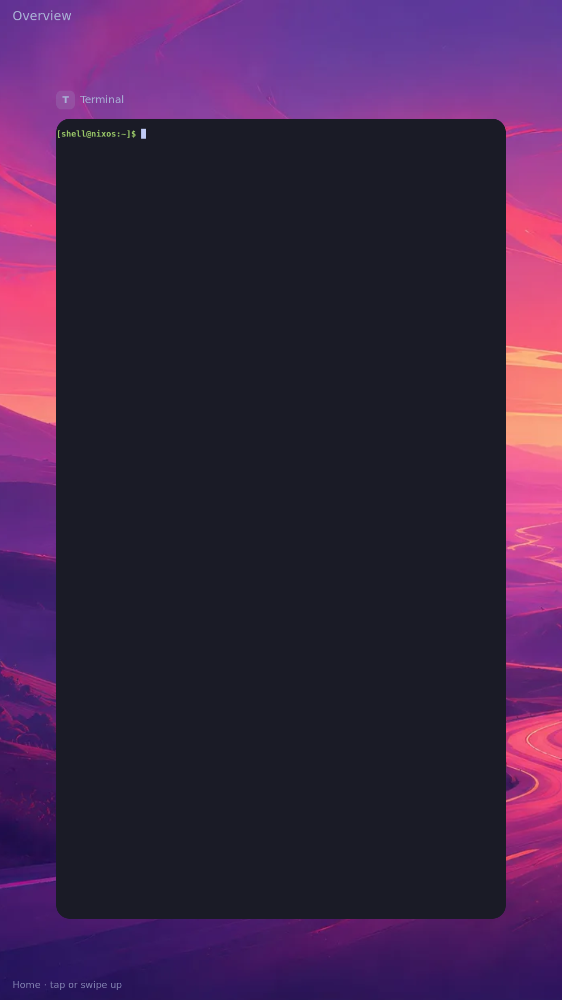
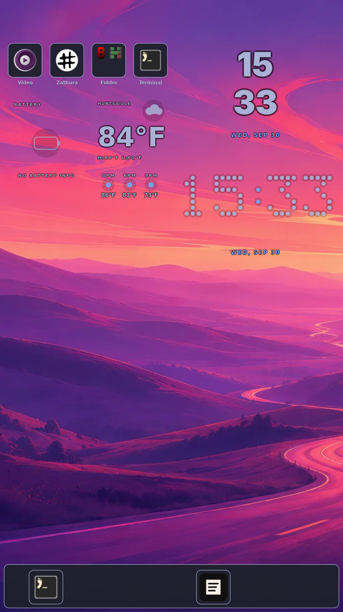
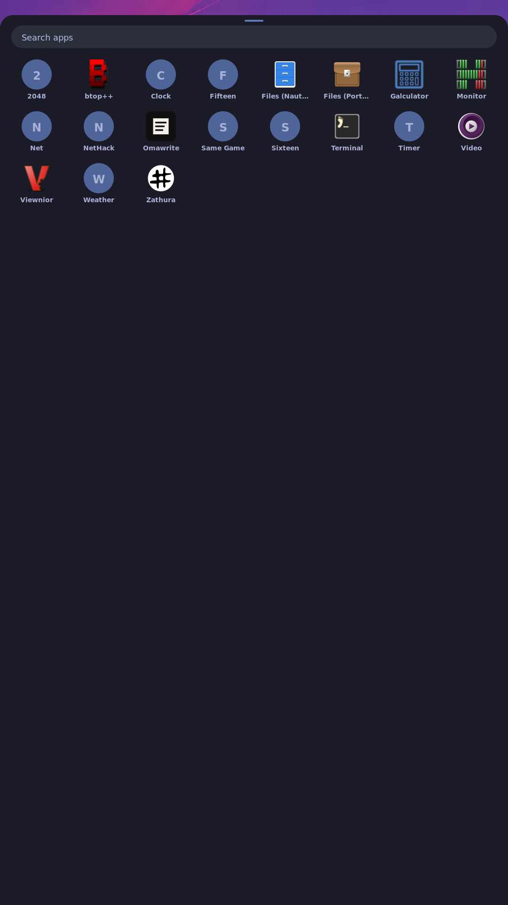
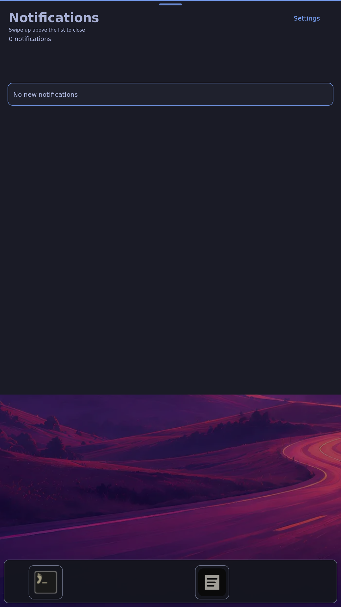

# Two-finger HDMI shell navigation

The HDMI trial now uses two fingers near the glass's physical edges to navigate
the shell, and continuous horizontal finger scrolling to move cards in overview.
The glass remains the trackpad while its display is inactive. Center input still
uses the original libinput relay for app scrolling, pinch and pointer behavior.

| Gesture | Behavior |
| --- | --- |
| Two fingers, bottom 12% of glass, upward | App → overview → Home → app drawer, one gesture per step |
| Two fingers, top 12%, downward | Notifications |
| Outward motion from the drawer's corresponding edge | Close the visible drawer; reverse while held to restore it |
| Horizontal two-finger scrolling in overview | Continuous card movement, stationary hold, release momentum |
| Existing four-finger inward / outward pinch | Overview / activate selected card, including return to overview from Home |

**Real-glass feel remains UNVERIFIED.** Host checks, the actual compositor under
QEMU, and injected raw input on the physical board are separate evidence classes.
There is no new operator acceptance or camera proof in this directory. In
particular, the board's single-card test does not prove physical browsing between
multiple apps; the three-client headless test covers the compositor behavior.

## Source, builds and checks

[Build identities and source hashes](build-and-source.json) name the branch,
base, owned paths, exact outputs and invocation. Source work used
`.scratch/coordinated-work/hdmi-gestures`, branch `fix/hdmi-gestures`, based on
`2faa383c8d0de5555fbc448a0f72eb48ab2e761c`. The planning commit
`c5802b946c1ad9b4548a9a2041321765330e86f6` was merged and pushed before implementation.
The coordinator reserved the single board/serial lock; builds reserved the Nix
build slot. No kernel, device tree, bootloader or flash change was made.

[Host results](host-checks.txt) preserve the commands and outputs. The actual
compositor tests cover held/reversed axes, lift/coast, pointer-device loss,
repeated sessions on a persistent IPC connection, three live clients, Home,
drawer/shade reversal and close, malformed/lost streams, and output changes.
The pointer fixture now waits for each app to map: its wheel assertion otherwise
depended on nondeterministic parallel client startup order.

The relay tests preserve original fall-through event order and timestamps,
check Protocol-B positions retained across contacts/restart, exercise fragmented
IPC replies and missing controllers, and bound both initial ownership and
asynchronous release. A slow-reply fixture proves release survives a 300ms frame.

## Physical-board injection

[Board result](board-result.json), [installed services](installed-services.txt)
and [raw relay log](relay.log) identify the matching running system. The bounded
trial creates a separate touchscreen fixture with the observed native ranges,
runs the actual relay, and restores the physical relay in `finally`; an
independent 90-second systemd timer provides a second restoration path. The
kernel filters unchanged slot axes, so these trials also exercise genuine
Protocol-B axis persistence rather than resending every coordinate artificially.

The result contains eleven raw-input checks and two explicitly labeled board
compositor IPC checks. These include navigation, card hold/lift, actual selected
app focus, malformed/lost-stream watchdog recovery, and fresh raw gestures after
recovery. The trial refuses to publish a passing result if an intended edge was
refused or any IPC rejection/timeout occurred. It removes stale result files
before starting. A scene becoming mapped alone is insufficient acceptance.

Operator commands, with the reserved board, staged tool and exact relay path:

```sh
python3 tools/console.py /dev/ttyACM0 --wait=5 'readlink -f /run/current-system; systemctl is-active shell shell-ui k230-touch-trackpad'
```

The board trial's exact watchdog/timeout/Python invocation is preserved in
[operator commands](operator-commands.txt). Transfers used a temporary local
artifact server and checked the export hash before importing; private network
addresses are omitted. Activation used the built system's
`bin/switch-to-configuration switch` with a timed rollback to the previous
working closure. This was a userspace system switch, not a new boot or flash.

## Reviewed native captures

Each image comes from board screencopy after injected input, with its original
hash and provenance in the board result. They show the pixels produced during
the trial; they do not establish touch feel, frame pacing or visual-design
acceptance. Existing Home layout is outside this gesture change.






## Failures that changed the implementation

[Sanitized timing observations](timing-observations.txt) preserve board draw
measurements and command timing. The early 100ms ownership deadline expired even
after the compositor accepted Begin. Small gesture replies now get an immediate
nonblocking send attempt; partial writes retain Sway's normal writable handler.
Ownership remains bounded at 250ms, with a short caller margin.

Home movement was absent from the existing motion-filter condition. Its rotated,
scaled card repeatedly used the bilinear sampler at roughly 370ms per draw. The
existing nearest filter now remains active through Home drag/settle, reducing
that measured card draw to roughly 40ms. This is a draw-cost comparison, not an
end-to-end latency or refresh-rate claim. Settled cards keep the quality policy.

An intermittent notification release exceeded the initial 250ms stream deadline.
A generic mapped/unmapped state check initially missed it; screenshot and relay
log review caught it. Movement/release run asynchronously with a bounded 750ms
reply deadline, below the compositor's 1-second ownership watchdog. The input
thread's initial ownership check retains its shorter deadline. Each new Begin
refreshes its monotonic epoch so another recovery controller cannot strand a
long-running relay below the last accepted sequence.

## Remaining acceptance

Tasks 3.2–3.6 and 5.6 remain open for their named physical proof: actual glass
recognition, direct tracking/reversal, release feel, multi-app browsing, ordinary
app scroll/pinch/click and HDMI-to-panel restoration. Use the proposal's bounded
`tools/capture-feature.py hdmi-trackpad-gestures --provenance real-touch` invocation
while the operator performs those actions; preserve reviewed camera/native/console
provenance and their feedback. Keep the change unarchived until every gate passes.

Review, merge/push and exact-revision Pages deployment are recorded separately
after landing; a cross-build alone is not deployment evidence.
