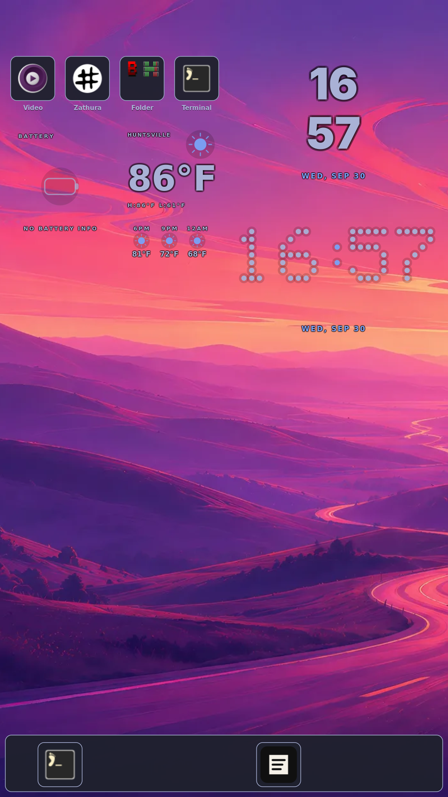
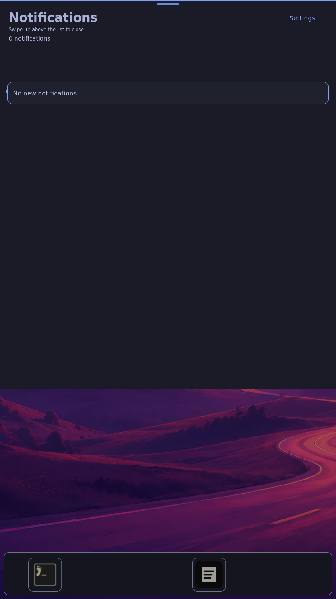
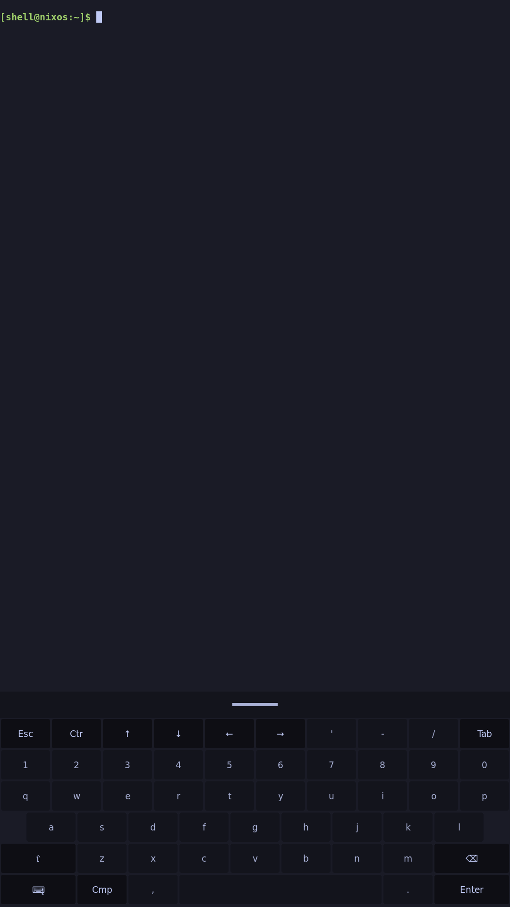

# Shared touch and HDMI trackpad gestures

Two physical fingers on the inactive panel glass become one logical contact in
HDMI trackpad mode. Three fingers from the bottom become the existing native
two-contact keyboard chord. The compositor and Rust shell retain ownership of
navigation, scrolling, drag reversal, release momentum and settling; there is
no second set of drawer-close thresholds.

| Direct touch | HDMI glass trackpad | Shared behavior |
| --- | --- | --- |
| One finger upward from bottom | Two fingers upward from bottom | App → overview → Home → installed-app drawer |
| One finger downward from top | Two fingers downward from top | Notifications |
| One finger dragging drawer content | Two fingers dragging drawer content | Scroll a list; downward at its top closes the app drawer; reverse while held |
| One finger dragging shade content upward | Two fingers dragging shade content upward | Close notifications using native movement and settling |
| One finger dragging cards | Two fingers dragging cards | Follow displacement, remain still while held, coast after release |
| Two fingers upward from bottom | Three fingers upward from bottom | Show the native keyboard with its existing chord policy |
| One finger dragging keyboard grip downward | Two fingers dragging keyboard grip downward | Hide the native keyboard |

Single-finger pointer/tap, ordinary app center scroll/pinch and existing
four-finger overview/activate bindings are preserved. A qualified pan cannot
turn into a tile tap or long press after tiny movement or reversal.

**Real-glass recognition and feel remain UNVERIFIED.** Headless compositor
injection, raw input injected on the physical board, and native screencopy are
separate from the operator's physical fingers and camera evidence. Earlier
physical tasks 3.2–3.6 and 5.6 remain open. Do not archive this change.

## Implementation and proof

[Host results](host-checks.txt) record the narrow commands and outcomes;
[component source identities](component-sources.json) match the built candidate
to the owned source files.

The relay qualifies a bounded contact chord and passes its centroid,
displacement and original monotonic input timestamps over one coalescing Sway
IPC worker. Declined streams retain their events and timestamps for libinput.
The compositor calls its existing input_down/motion/up or keyboard policy. Only
the actual shell Home/drawer surfaces receive translated standard Wayland touch;
ordinary apps never receive fabricated touch. Loss of the client/controller,
output changes, malformed streams and the ownership watchdog cancel cleanly.

The headless input fixture uses the raw board fixture's 25ms frame cadence;
zero-duration synthetic gesture bursts exposed asynchronous surface unmap and
output configure races and are not used as physical timing evidence.

The actual-compositor fixture uses three live Wayland apps, the real native
Rust shell, 48 desktop-entry fixtures and actual wvkbd. It checks native drawer
scroll-at-top behavior, closing/reversal/cancellation, no accidental launch,
card hold/release, keyboard contact counts and recovery. The physical-board
fixture uses real kernel Protocol-B filtering, the matching installed relay and
native screencopy. Neither fixture establishes real-glass feel.

## Installed board result

[Board result](board-result.json) passed 15 checks, with 11 accepted raw
translated gestures and no IPC rejection or timeout in the [relay log](relay.log).
Two checks use explicitly labeled compositor IPC. The board had one app;
physical multi-app browsing is not claimed. [Installed service identities](installed-services.txt),
[build/source records](build-and-source.json) and [operator commands](operator-commands.txt)
identify the matching userspace switch. It used a checked closure export and
independent activation rollback and relay restoration timers, with no reboot,
flash, kernel or device-tree change.

All five native captures were visually reviewed, their hashes checked against
the result, and no network credentials or private addresses were present. These
are native pixels after injected input, not camera or real-glass evidence.







## Timing failure and correction

The first uniform board candidate reached overview but timed out acquiring its
next center card drag: its relay logged Begin WouldBlock. That run did not
produce a passing result. A settled bilinear HDMI card redraw could occupy the
compositor event loop beyond the bounded 250ms ownership handshake. The common
motion sampler now remains active for a 300ms quiet interval between gestures.
The relay selects CLOCK_MONOTONIC on its own evdev fd and preserves source
frame timestamps through IPC, so queued frames cannot acquire artificial release
velocity from their later reader times. Other input consumers retain their
own clock. EVIOCSCLOCKID was independently compared with the Linux UAPI.

## Remaining operator check

On the installed candidate, use real two-finger bottom/top gestures, drag and
reverse drawer content, scroll to its top before closing, and drag cards with a
hold and a fling. Show the keyboard with three fingers from the bottom, then
hide it with two fingers on its grip. Also check one-finger click and ordinary
app scrolling/pinch, then HDMI-to-panel restoration. The capture command is:

```sh
python3 tools/capture-feature.py hdmi-trackpad-gestures --provenance real-touch --duration 30 --description 'Uniform HDMI shell gestures' --output-dir docs/evidence/the-touchscreen-becomes-an-hdmi-trackpad/uniform-gestures
```
