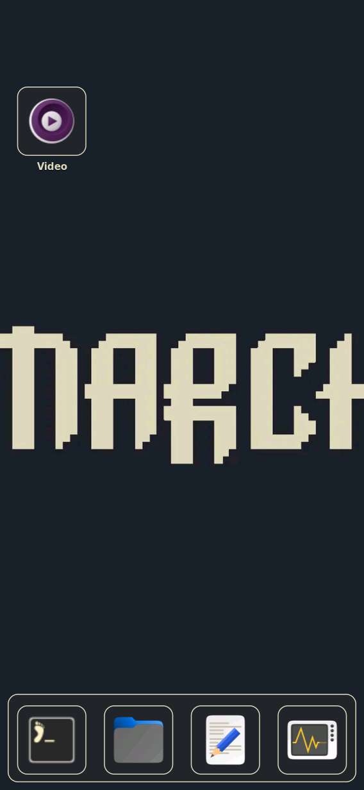
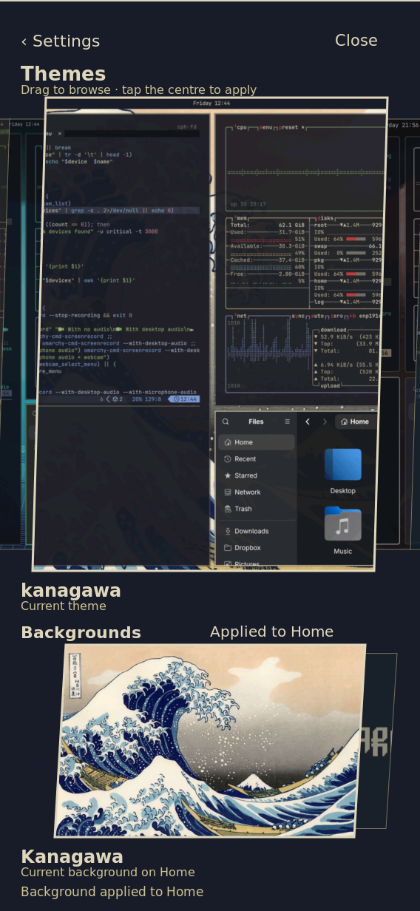
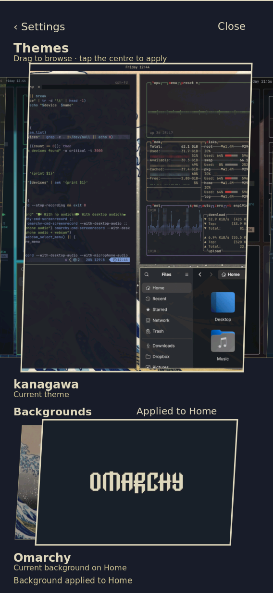
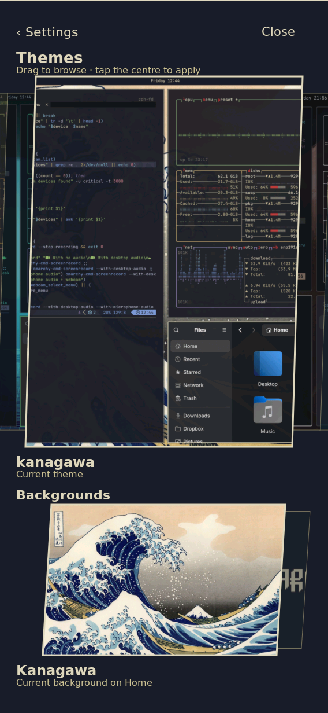

# A background tap changes Home and shows its result

Physical-board check, 2026-09-27 UTC. The installed Rust fix is source
`97785ec7`; `a7aa8d49` updates the synthetic QEMU harness. These observations
use injected input through a verified virtual touchscreen and native `grim`
captures. They are not real-finger acceptance or a performance benchmark.

The picker formerly sent a different background ID with the previous
background's generation. Generations include the background choice, so the
helper correctly rejected that request as stale. The picker now prepares the
exact selection, activates its returned generation, and only then marks it
current. Applying and success feedback appear beside the Backgrounds heading.
Failure retains the previous selected background. Successful theme activation
also refreshes the catalogue's current theme identity.

## Reviewed native captures

The first tap changed Kanagawa's wave to its Omarchy logo background. The
return tap changed the logo back to the original wave. No helper activation
command was used: both changes came from tapping the centred picker slice.







`result.json` records generation `2bb733c7b8cd8fd5c7d089e2` changing to
`e51dc5dd61dff5d30438dcec`. The helper's remembered selection matched the
active generation. Restarting `shell-ui` and `theme-helper`, then reopening
Settings → Themes, retained that choice; the final capture shows its current
marker. The original terminal was temporarily parked in the scratchpad to
expose Home and then returned to its original workspace. No app was closed.

## Commands and identities

```sh
cargo test --offline --manifest-path nix/rust-shell-client/Cargo.toml --lib theme_ui
python3 -m unittest tests.test_theme_catalog
nix build .#nixosConfigurations.k230-coherent-shell.config.system.build.toplevel --cores 8 --no-link
python3 tests/rust_theme_chooser_qemu.py \
  --sway /nix/store/7zvingic0whhz3z80w2gcpc343vipf7q-sway-unwrapped-riscv64-unknown-linux-gnu-1.12/bin/sway \
  --rust /nix/store/32h8rhx71c9ccah9n5yhz4f8khq3i2px-k230-shell-rust-riscv64-unknown-linux-gnu-0.1.0/bin/k230-shell-rust
```

The 24 Rust picker tests and 21 Python catalogue tests passed. The paired
Sway/Rust QEMU interaction passed with a synthetic backend that gives each
background choice a distinct generation. Earlier harness attempts exposed
its premature route request and obsolete collapsed-pitch drag assumptions;
the harness now waits for route readiness and uses rendered-center distances.

`manifest.json` records the candidate system, source and boot-file hashes:
`/nix/store/1qx2c46qbfyb91cxdxvrxnqwfm82gl06-nixos-system-nixos-26.11.20260919.20b1ddd`.
The running Rust binary is the `32h8rh…` executable above. The kernel and
initrd are unchanged from the previously booted `7hhr1fp…` system.

The exact board workload is `board-selection-check.py`; it imports the
committed `../finger-tracking/k230-picker-baseline.py` touch helper staged as
`/run/k230-background-fix-control/touch.py`. The board's Python interpreter
was `/nix/store/v189xydz6qkcd4cbkixcmv91w8hbc560-python3-riscv64-unknown-linux-gnu-3.14.7/bin/python3`.
Run the workload on the reserved board with arguments `SYSTEM PROTECTED_URL
inspect`, then `apply`, then `finish`. The protected transfer endpoint is
provided only at runtime; its configuration and transcripts are not evidence
assets. `inspect` records the initial state, `apply` selects the other still
background and captures Home, and `finish` restarts services, restores the
parked app and captures the reopened picker. Each phase ran under a bounded
systemd service, with virtual-input identity checks before injection.

## Deployment and limits

A guarded runtime trial preceded persistent installation using the unchanged
`../finger-tracking/persist-userspace.sh` helper. The unique transaction is
`/var/lib/k230/background-fix-persist-20260927/background-fix-transaction`.
`persist-result.json` records SUCCESS; `persist-verified.json` independently
checks the service exit, candidate boot hashes, unchanged firmware/selectors,
installed profile and sync. No full-card readback was performed.

The first persistence attempt stopped before boot mutation because a generic
GC-root name already existed; retrying with the unique transaction name
succeeded. Initial capture setup also used the wrong IPC socket glob and
encountered the ordinary-app backdrop on an empty workspace. The final
captures use the configured IPC socket and temporarily parked terminal.
These are harness/setup failures, not hidden successful observations.

Normal reboot into this new userspace image has not been performed. The
candidate is running and selected for the next normal boot; the current boot
still began with the previous system. Real-finger acceptance and the wider
picker performance/profiling tasks remain open.

The public evidence page and work-card screenshot discovery were verified at
`d937b8cd` after [Pages build and deployment 36298384207](https://github.com/knewter/tdisplay-k230/actions/runs/36298384207)
succeeded. The initial site failures were resolved by reconciling a concurrent
proposal archive's dashboard override and adding all five PNG hashes to the
binary inventory. The full local site build passed (343 pages, 10.84 MB).
