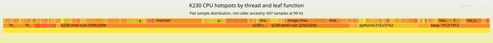

# First sampled CPU profile on the K230

On 2026-09-27 UTC, the physical board recorded **697 CPU-clock samples at
99 Hz** during a 20-second picker workload. These are actual sampled stacks,
separate from the earlier elapsed-span trace. The normal installed shell kept
running; this trial installed no boot files or persistent service configuration.



- [Interactive CPU stack flamegraph](cpu-flamegraph.svg): open the standalone
  SVG to zoom/search. Caller chains are incomplete; see the limits below.
- [Flat CPU hotspot view](cpu-hotspots.svg): thread → sampled leaf function,
  deliberately without a claim about intervening callers.
- [Stack quality and counts](stack-quality.json), [workload/identities](workload.json).
- Reviewed folded inputs: [stacks](stacks.folded), [hotspots](hotspots.folded).
- [Capture script](capture.py), [summary conversion](summarize.py), [hashes](SHA256SUMS).

## Observations and limits

The interactive Rust shell's main thread accounted for 274 samples; its other
sampled worker had 27. Sway had 86. A separate `k230-shell-rust` descendant had
111, a Python descendant had 84, and the four sampled theme-helper request
threads had 45 combined. Keeping PID/TID identity prevents helper subprocess
work from being mislabelled as the interactive shell's own work. Remaining
samples were other inherited helper/session descendants.

The most frequent leaf functions included `memset` (72 samples), image resize
(38), an RVV Pixman blend (22), RGB565 fetch (21), SHA-256 (17), and WebP color
conversion (17). This identifies real CPU work to investigate; it does not
establish that any individual function caused a particular slow frame. Route
opening, preparation and four short swipes are mixed in this first profile.

**648 of 697 samples contain at least one unresolved caller.** Their leaf PCs
resolved, but one collapsed stack reaches 128 entries including its thread
label. Complete call-chain attribution still needs a build and unwinder with
verified frame pointers/symbols throughout the relevant binaries and libraries.
The flamegraph preserves unknown frames. The flat hotspot view avoids drawing
conclusions from incomplete ancestry. There were no `perf script` warnings or
collapse warnings; that does not remove these observable stack-quality limits.

All reported periods were 10,101,010 ns. The conversion checks that uniform
period before turning the collapsed weights into 697 sample counts. The
weighted total is approximately 7.04 CPU seconds sampled across the selected
processes and inherited descendants, not 20 seconds of continuous CPU use or
exact scheduler accounting. No matched sampler-off observer-cost comparison
was performed. This is a separate run on the normal installed shell, not the
same workload window as the [span timeline](../runtime-trace/README.md).

## Build and capture proof

Sampler source: `fea39e05e0f4bc2f925f0934693efeac61c4e505`.

```sh
nix build .#runtime-perf --cores 8 --no-link --print-out-paths
nix build .#nixosConfigurations.k230.pkgs.buildPackages.flamegraph --no-link
```

Both passed. The diagnostic sampler is
`/nix/store/qhf9h2sig8x8ay4gfn33as5gccl4vn6d-perf-k230-runtime-riscv64-unknown-linux-gnu-7.2.6/bin/perf`;
`perf --version` on the board returned `perf version 7.2.6`. Its closure delta
from the installed system was three store paths, exported as 6,282,088 bytes.
The package retains ELF/unwind support and omits the optional TUI, embedded
Python, CTF export, BFD annotation dependency and SystemTap features. It is not
added to the normal image. The earlier stock-package build was superseded by
this smaller successful build.

The operator held the board reservation, imported that delta, verified the
virtual touchscreen identity, then ran `capture.py PERF_PATH PROTECTED_UPLOAD_URL`
in a transient `Type=exec` unit with `RuntimeMaxSec=90s`. The actual sampling
command was:

```sh
perf record -e cpu-clock -F 99 -g --call-graph fp -p 1912,2006,2004 \
  -o /run/k230-perf-private/perf.data -- sleep 20
```

Those PIDs came from `shell`, `shell-ui` and `theme-helper` service identities;
they are evidence for this run, not reusable operator constants. The capture
checks their start ticks and executables afterward. It opens Settings/Themes,
then injects 40-pixel left/right gestures in both rows. The active generation
hash was unchanged. The raw data, raw stack text and transport URL remain
private; artifact hashes and safe runtime identities are in `workload.json`.

A second text export retained PID/TID, using the same captured data:

```sh
perf script -F comm,pid,tid,time,period,event,ip,sym,dso \
  -i /run/k230-perf-private/perf.data > /run/k230-perf-private/perf-threads.private
```

The `cpu` field is deliberately omitted: this process-attached recording did
not request the CPU attribute, and requesting it caused `perf script` to refuse
that first export. That failed export was corrected without repeating sampling.

Host conversion used the pinned
`/nix/store/lfks2w9hja6xdiggi2snp29qj5vvdimz-FlameGraph-2023-11-06` tools:

```sh
stackcollapse-perf.pl --tid perf-threads.private > stacks-thread-aware.private
python3 summarize.py stacks-thread-aware.private OUTPUT_DIRECTORY
flamegraph.pl --hash --countname samples --width 1600 stacks.folded > cpu-flamegraph.svg
flamegraph.pl --hash --countname samples --width 1600 hotspots.folded > cpu-hotspots.svg
```

The committed SVGs also set descriptive title/subtitle text. XML parsing and
all 697 sample-count checks passed. Afterward the virtual input unit was stopped;
its diagnostic timeout state was cleared, and the previous `7hhr1fp…` system
remained active with the five shell/helper services active and no failed units
([final observations](final-runtime.json)). Source instrumentation remains default-off.

Compositor stage spans, scheduler correlation, full caller-chain qualification,
matched observer-cost runs and another interaction remain OpenSpec task 15 work.
