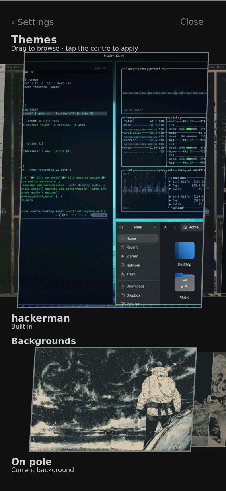
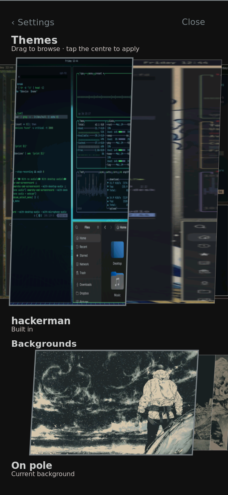
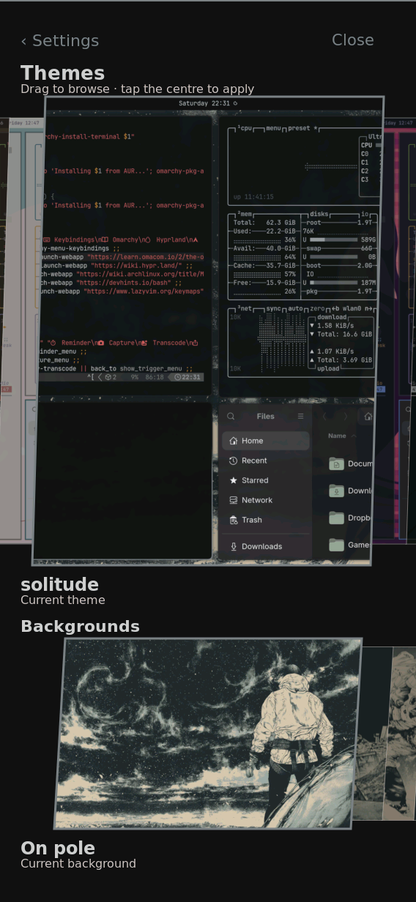
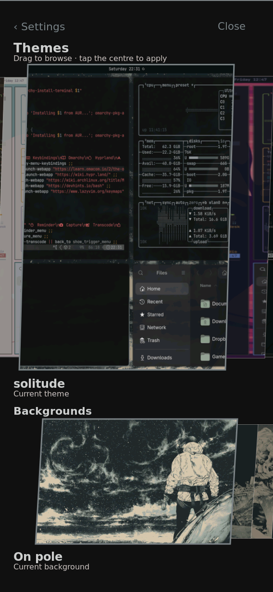

# Theme picker follows the contact displacement

Recorded 2026-09-27 UTC on the reserved physical board. Source `0c199c76`
changes both carousel geometries to invert the rendered card-center path and
coalesces pending picker motion before drawing. This is injected input and
native capture evidence; real-finger acceptance remains open. Persistent installation results follow
below.

The old formula divided motion by the collapsed thumbnail pitch (49 pixels
for themes, 43 for backgrounds), although the expanded center moved much
farther. The new formula maps a contact displacement back through that actual
center trajectory. A held contact does not coast; a release after a stationary
hold expires the old velocity.

## Identities and commands

`manifest.json` names the exact source, candidate system and four candidate
boot artifacts. `trial-runtime.json` records the successful guarded
`switch-to-configuration test`: candidate `7hhr1fp…`, booted/installed baseline
`11y992kp…`, unchanged kernel, all four shell services active, and no failed
units. A 15-minute automatic restoration timer was armed before activation
and restarted once to allow operator testing. This did not modify normal boot
files or the system profile.

The full candidate was built with:

```sh
nix build .#nixosConfigurations.k230-coherent-shell.config.system.build.toplevel --no-link
```

The archived `k230-picker-baseline.py` is the exact input helper imported by
`tracking-probe.py`. Both were staged under `/run/` on the board; its Python
was `/nix/store/v189xydz6qkcd4cbkixcmv91w8hbc560-python3-riscv64-unknown-linux-gnu-3.14.7/bin/python3`.
After opening Settings → Themes and waiting seven seconds, the commands were:

```sh
python3 /run/k230-picker-tracking-probe.py --label old --output /run/picker-tracking-old.json
python3 /run/k230-picker-tracking-probe.py --label new --output /run/picker-tracking-new.json
```

Each command ran only against its corresponding verified Rust executable
(full paths in the JSON). The virtual touchscreen name and virtual sysfs path
are checked before any event is written. Four 200 ms drags move 20 pixels,
left then right in each row, with 1.5 seconds held stationary before release.
Both runs retained the same saved-generation hash throughout. Twenty motion
samples were processed in every phase.

## Observed processing backlog

| Row/direction | Old last motion after injection ended | New |
| --- | ---: | ---: |
| Theme left | 227.365 ms | 27.481 ms |
| Theme right | 219.772 ms | 18.914 ms |
| Background left | 147.354 ms | 71.993 ms |
| Background right | 151.848 ms | 0.674 ms |

The candidate committed 2–4 frames per contact/hold period for 20 motion
samples, rather than rendering every sample. Four commits followed release
to settle back to the nearby center. Journal reception timestamps approximate
userspace processing; these are not scanout latency or presentation FPS.
This is one short before/after comparison, not task 13's matched three-pair
performance test. The visible themes differed (old Hackerman, new Solitude),
so image-content cost and cache warmth are uncontrolled here.

## Held geometry

Each native pair was captured separately from timing using `grim`, then
`native_touch('/dev/input/event1',284,430,264,430,held=...)`. The callback
waited 1.5 seconds and captured before releasing the contact. The same verified
virtual input helper was used. The screenshots were visually reviewed.






The old expanded preview's center moves roughly 104 pixels; the candidate
center moves roughly 20 pixels. Card width also changes as focus interpolates,
so this demonstrates center tracking, not rigid translation of every edge.
No theme was applied by these captures. Native images do not prove the panel's
physical response, and the stationary hold does not prove fast-fling quality.

Host checks at the source revision passed 13 carousel tests and 19 route
tests. Task 14.4 still requires the operator's real-finger verdict; tasks
11.3/13 still require the broader performance and memory comparison.


## Persistent userspace installation

`persist-userspace.sh` is the exact board helper (SHA-256
`35b979fefcc50eb429485b71028322f99fc0efcb8462e2935597a448b903a7e7`). It
reuses the earlier verified rollback/capacity transaction and additionally
requires identical booted/candidate kernel and initrd store objects, a current
runtime matching the candidate, and a backup/profile matching the booted
system. The candidate Image also must compare equal to the installed Image.
Five host cases passed for these identity guards: accept matching kernel and
initrd; reject differing kernel, differing initrd, invalid booted identity,
and wrong current system. `bash -n` passed; the board helper's hash matched.

A fresh eight-file normal-boot backup and four-file candidate bundle were
staged and verified under `/var/lib/k230/picker-finger-persist-20260927`.
The first staging service failed before making that directory because its
service PATH omitted coreutils. It was rerun with an explicit system PATH
and succeeded. No boot file had been touched by that failed staging attempt.

After the guarded runtime trial, the restoration timer was stopped and the
board ran:

```sh
bash /var/lib/k230/picker-finger-persist-20260927/persist.sh \
  /nix/store/7hhr1fp722cq147svn5ni67ar1i66mys-nixos-system-nixos-26.11.20260919.20b1ddd \
  /var/lib/k230/picker-finger-persist-20260927/new \
  /var/lib/k230/picker-finger-persist-20260927/previous \
  /var/lib/k230/picker-finger-persist-20260927/transaction
```

`persist-result.json` records SUCCESS, exit 0, and the previous profile.
`persist-verified.json` records independent checks of the completed service,
all four candidate boot-file hashes, four unchanged firmware/selectors,
the candidate system profile, and sync. The boot update remains non-atomic;
its verified rootfs backup and recovery recipe were retained. No full-card
readback was performed. This installation does not enable a second CPU.


The subsequent **normal reboot passed**. `normal-runtime.json` records the
candidate `7hhr1fp…` as current, booted and installed-profile system, with
Rust executable `pzqqphc…`, Sway `7zvingic…`, all four shell services active
and no failed units. The serial listener required a fresh Linux kernel banner
before accepting a root prompt, and runtime identity was checked separately.
Linux still reports CPU online mask `0`. The retained kernel and initrd were
unchanged; this verifies persistent userspace deployment, not real-finger
acceptance or CPU bring-up.
