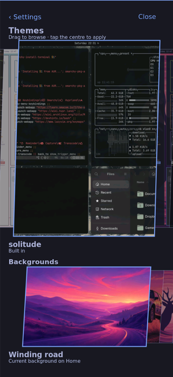
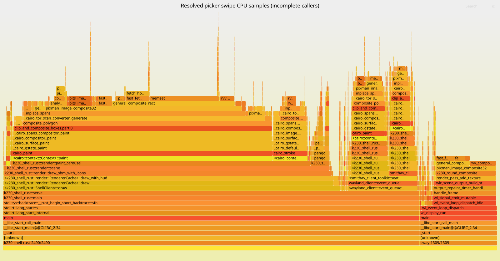

# Resolved picker baseline and row repaint

Physical board, 2026-10-01. The user reports that background browsing is better
than theme browsing but both remain janky. Later feedback: somewhat less janky,
with acceleration/settling still unsatisfactory. That later observation precedes
installation of this row-repaint candidate and is not candidate acceptance.
Task 14.4 remains open.



Source baseline: `b57ba41ccf6755c54039fc85b0a54145001b186a`; actual runtime
`/nix/store/xphf8zb00gz9hiyqkkh399rldr2ljykb-nixos-system-nixos-26.11.20260919.20b1ddd`.
[Workload identities and windows](baseline-workload.json) record the exact Rust,
Sway and helper identities, eight backgrounds, and unchanged generation.
Native capture ran separately from timing. Input used a verified virtual
`K230 injected touchscreen`; this is not real-finger proof.

## Span measurement

The committed [collector](../finger-tracking/k230-picker-baseline.py) injected
20 motion samples across 200 ms per swipe: six theme swipes, four background
swipes, a reopen, then six warm theme swipes. It retained 1.2 s settling per
swipe and named idle intervals. Bounded default-off Rust/helper traces used
matching trace IDs, `K230_TRACE_SECONDS=120`, independent 180 s service restore,
and were exported with:

```sh
python3 tools/runtime-trace-export.py rust.json helper.json \
  --timeline baseline-timeline.json --summary baseline-summary.json
```

[Timeline](baseline-timeline.json), [frame report](baseline-summary.json), and
[phase costs](baseline-phase-costs.json) preserve measured CPU separately from
wall time. There are 160 presented frames, no dropped events or export warnings,
and active presentation gaps p50 134.122 ms, p95 210.752 ms, p99 249.094 ms.
Idle intervals are excluded by the exporter; these numbers include different
active actions and are not a standalone swipe FPS claim.

Warm theme frames spend median 95.236 ms thread CPU in overlay drawing,
including 91.770 ms scene CPU, versus 2.847 ms copying. These are separately
aggregated medians, so they are not additive. The trace also records one
speculative admission with a row moving. This motivates testing row damage
and enforcing both-row rest before speculative preparation.

The first wrapper collected its workload successfully but checked the helper
trace before its later 120 s deadline. The independent finally-path removed
trace overrides and restarted both services. Both intact completed records
were recovered afterward and validated; the wrapper's first exit is not a
clean capture success. On/off first-open histories differ (service restart
only in tracing-on). This is not the full matched observer-overhead proof.

## Separate sampled CPU profile

```sh
nix build .#runtime-perf --no-link --print-out-paths --max-jobs 1 --cores 4
perf record --clockid mono -e cpu-clock -F 99 -g --call-graph fp \
  -p <verified-Sway,Rust,helper-PIDs> -o perf.data -- sleep 24
perf script -F comm,pid,tid,time,period,event,ip,sym,dso -i perf.data
stackcollapse-perf.pl --tid perf-script.private > cpu.folded.private
flamegraph.pl --hash --countname samples --width 1600 cpu-stacks.folded
```

Actual sampler: `/nix/store/qhf9h2sig8x8ay4gfn33as5gccl4vn6d-perf-k230-runtime-riscv64-unknown-linux-gnu-7.2.6/bin/perf`.
[Sampler metadata](perf-summary.json) includes the actual invocation and twelve
120 px / 200 ms swipe windows (six per row), identities and generation check.
The record contains 1,490 samples: Rust 1,256, Sway 233, helper 1.
[Quality](cpu-quality.json) records all leaf PCs resolved but every sample has
an unresolved caller; complete call-chain attribution remains unqualified.
Uniform 10,101,010 ns periods were converted to sample counts without inventing
frames or removing unknown callers. Raw addresses and paths remain private;
[raw capture hashes](capture-hashes.json) identify the original private artifacts.



This is a separate injected workload from the span run, without a paired sampler
overhead measurement. It does not close compositor/scheduler tracing, complete
stack qualification, wider working-set/overhead tasks 13/15 or finger acceptance.
Candidate comparison follows below when the actual cross-build is tested.

The first matched physical injected-input comparison is [recorded here](pair/README.md); it improves measured cadence, keeps motion/real-finger acceptance open, and restores the normal shell afterward.
