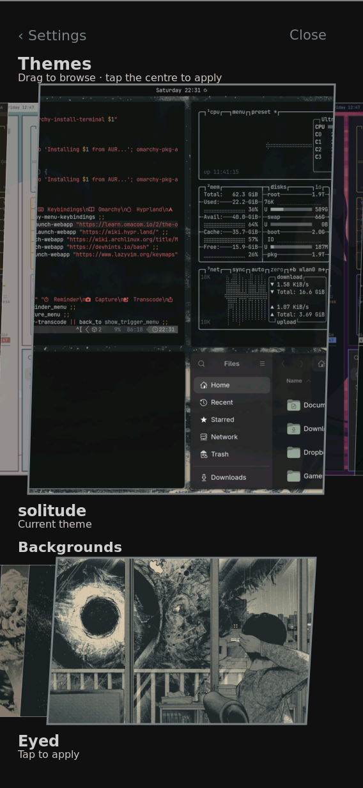

# Saved theme and backgrounds resolve after package relocation

Physical board, 2026-09-27 UTC. Candidate source `433a4226`, system
`/nix/store/11y992kp7bikr5hg21i2azfvmca43i7i-nixos-system-nixos-26.11.20260919.20b1ddd`.
Both booted and running system identities matched the candidate during this
one-time boot. The exact kernel and service executables are in
[result.json](result.json).


Before the repair, the catalog returned a null active ID and the background
row stayed loading; see [the browsing observation](../working-set/README.md).
With the repair, `k230-theme list` returns an active ID, 23 catalog entries
and the preserved generation. Its saved report contains five backgrounds.
The native image shows the saved theme centered, marked “Current theme,”
and its background row populated with “Current background” on the saved
selection. The generation identity hash exactly matches the earlier runs;
no theme was activated and no saved pointer was rewritten.

## Reproduction and limits

After verifying the candidate's system and service identities, show Settings
as the shell user:

```sh
runuser -u shell -- env XDG_RUNTIME_DIR=/run/shell k230-shell-rust --surface settings
```

The coordinator injected one tap at `(480,130)` through the distinct virtual
touchscreen, using `native_touch` from the [browsing collector](../working-set/capture.py).
The fixture verifies its name and `/sys/devices/virtual/input` provenance;
the physical touch device is never written. After the picker settled:

```sh
runuser -u shell -- env XDG_RUNTIME_DIR=/run/shell WAYLAND_DISPLAY=wayland-1 grim /run/shell/picker-fixed.png
runuser -u shell -- env XDG_RUNTIME_DIR=/run/shell k230-theme list
```

Raw list output remained private; the committed result retains only counts,
booleans, a generation identity hash and approved runtime identities.

The original one-shot trial established selection lookup and populated
content, but left normal installation and repeated browsing open. The
following installed-system check closes those remaining task 12.2 gates.

## Installed system and repeated browsing

The corrected persistent installation and normal reboot are verified in
[the combined install evidence](../../backlight/combined-candidate/README.md).
The installed `11y992kp…` system resolves the same saved theme, 23 catalog
entries and five backgrounds. Its initial native screenshot is byte-for-byte
identical to `current-theme.png` above; see [identities and hashes](installed-result.json).

An injected horizontal background drag from `(430,990)` to `(190,990)`
visibly moved the row from “On pole” to “Eyed,” displaying “Tap to apply.”
The saved generation was not changed. The image was visually reviewed.



After returning to Settings, the same [bounded browsing collector](../working-set/capture.py)
ran with `--device /dev/input/event1 --expect-rust-exe <installed Rust path>
--state-root <protected active-state root> --label new --output <unique private JSON>
--settings-ready`. The fixture identity was verified as virtual. It browsed
six theme swipes, four background swipes, returned to Settings, reopened,
and repeated six warm theme swipes, with two 15-second idle windows. No media
capture ran during measurement. The native images were captured separately.
The [public result](installed-browse.json) was reduced using the same
allowlisted reducer; only its single-run comparison limit was clarified.

| Observation | Result |
| --- | --- |
| Duration / capture errors | 70.93 seconds / 0 |
| Saved generation | unchanged in every sample |
| Theme swipe commit gaps, median / max | 124 / 228 ms |
| Background swipe commit gaps, median / max | 100.5 / 201 ms |
| Warm theme swipe commit gaps, median / max | 141 / 211 ms |
| Idle redraws, first / warm | 0 / 0 |
| Rust CPU during idle, first / warm | 0.55% / 0.42% |
| Rust RSS during idle, first / warm | 83,423,232 / 94,281,728 bytes, stable in each window |

This completes task 12.2: installed content resolves and responds while
browsing preserves the saved theme. It does **not** establish smooth swipes
or an improvement over the earlier run, whose background content was missing.
Task 11.3 and the matched profiling/optimization work in task group 13 remain
open. Commit gaps are shell submission timing, not panel presentation FPS;
all gestures here are injected, not real-finger acceptance.
