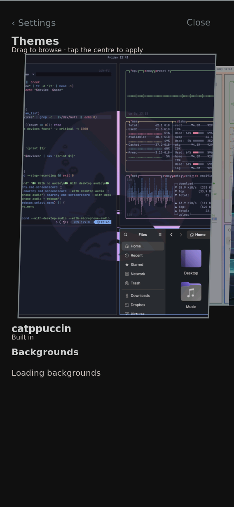

# Picker browsing: partial improvement, acceptance still open

Physical board, 2026-09-27 UTC. This compares one injected browsing run
before and after source `2fb371a5`'s bounded thumbnail working set and
motion pre-render gate. The new run exposed a saved-theme lookup failure:
backgrounds stayed at “Loading backgrounds.” **This is not a completed
picker performance result.**



[Sampled native browsing video](browsing.mp4) · [Old measurements](old.json) ·
[New measurements](new.json) · [Catalog check](catalog-status.json)

## Observations

| Observation | Old | New |
| --- | ---: | ---: |
| Initial theme swipe median commit gap | 136 ms | 83 ms |
| Initial theme swipe maximum gap | 242 ms | 265 ms |
| Warm theme swipe median commit gap | 125 ms | 132 ms |
| Warm theme swipe maximum gap | 258 ms | 285 ms |
| Speculative pre-renders completed while touch held | 5 | 0 |
| First observed opening: overlay commits | 26 | 9 |
| Warm reopening: overlay commits | 15 | 2 |
| Background drag overlay commits, four drags | 28 | 0 |
| Each 15-second idle window: overlay commits | 0 | 0 |
| Idle Rust CPU | about 0.3% | about 0.3% |
| Rust RSS after warm idle | 97.80 MiB | 90.95 MiB |

All sixteen drags in each run delivered down, twenty moves and up. The
active generation remained unchanged. Both runs used the same kernel Image
and compositor executable; the exact systems and Rust executables are in
the JSON records. The catalog contained 23 themes; the active saved report
contained five backgrounds.

The motion gate is exercised and no speculative completion occurs while
touch is held in the new run. Warm swipes are still slow. Neither run
reproduces continuous idle redraws. The missing background row confounds
the opening and memory comparisons: fewer commits or lower RSS cannot be
called a performance win when expected content is missing. The old process
was already running before this test; neither first opening is asserted
to be a matched cold start.

After the new run, `k230-theme list` reported an active generation but a
null active catalog ID. Source inspection found that matching only the
saved source path loses a bundled theme when a rebuilt Nix package moves
that source into a different store directory. No activation or credential
change was performed. The existing proposal tracks that repair separately.

## Reproduction and provenance

The root coordinator reserved the board and serial port. A distinct evemu
device copied the physical touchscreen descriptor, named
`K230 injected touchscreen`. The collector refuses any event node whose
sysfs path is not beneath `/sys/devices/virtual/input` with that exact name.
It never writes injected events into the physical touchscreen node.

With Settings visibly open and the virtual device at `/dev/input/event1`:

```sh
/nix/store/v189xydz6qkcd4cbkixcmv91w8hbc560-python3-riscv64-unknown-linux-gnu-3.14.7/bin/python3 /run/k230-picker-baseline.py \
  --device /dev/input/event1 --expect-rust-exe EXACT_EXE_FROM_PROC \
  --state-root /home/shell/.local/state/omarchy/current \
  --label old --output /run/picker-old.private.json --settings-ready
```

Repeat with the new exact executable, label and output. [capture.py](capture.py)
is the collector; [reduce.py](reduce.py) retains numeric observations and
approved executable identities, hashes the active-generation identity,
and omits raw journal text and private state paths. Initial launch with
`python3` on PATH failed before input because the image does not expose it
there; the recorded runs used the exact pinned interpreter above.

The sequence is Settings idle 2 seconds; open 10 seconds; six theme drags
and four background drags with 1.2 seconds settling each; idle 15 seconds;
back/reopen 5 seconds; six warm theme drags; idle 15 seconds. Process CPU,
RSS and service cgroup CPU are sampled about every 0.5 seconds. Journal
collection follows the sequence. Commit gaps use Rust elapsed timestamps;
phase assignment uses journal monotonic timestamps. The gaps include each
swipe's settling period and are not display presentation FPS.

The separate video pass used `tools/sample-grim-frames.sh`, 15 seconds,
minimum interval 0.5 seconds, provenance `injected`. It contains six theme
drags, captured in 22 native frames. `tools/encode-grim-samples.py` preserves
their recorded timing; see [frames.tsv](frames.tsv) and
[encoding record](browsing.json). It demonstrates content and the loading
failure, not smoothness. No camera or real-finger evidence is claimed.

Task 11.3 stays open: repair background selection, then repeat the warm
browsing comparison with equivalent visible content and inspect the
remaining rendering cost. The unchanged generation and inactive CPU at
rest do not establish that carousel swipes meet a usable frame budget.
