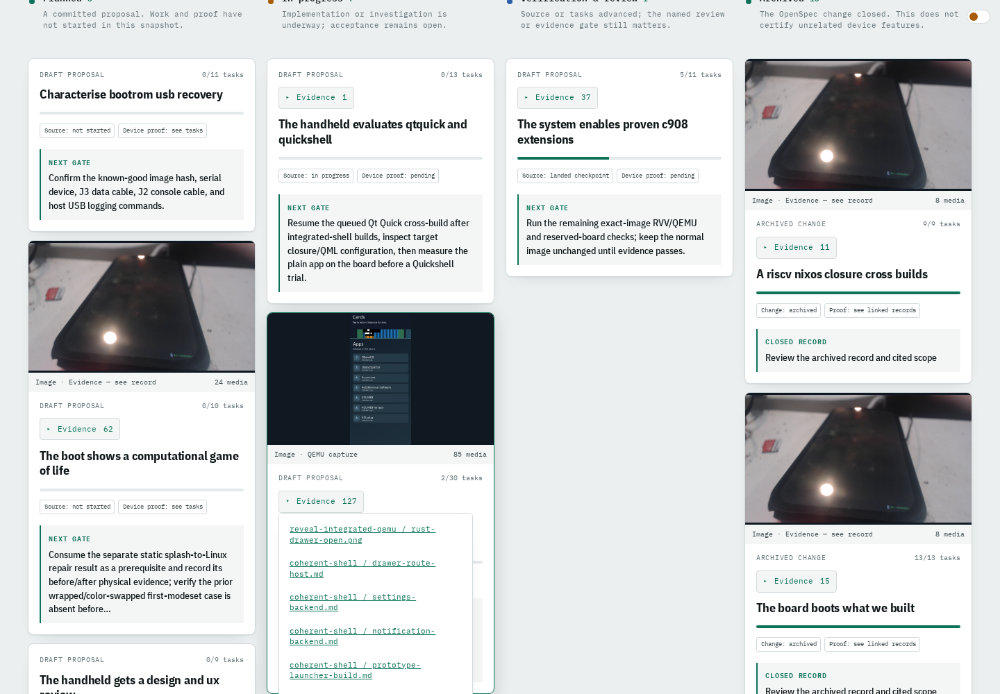
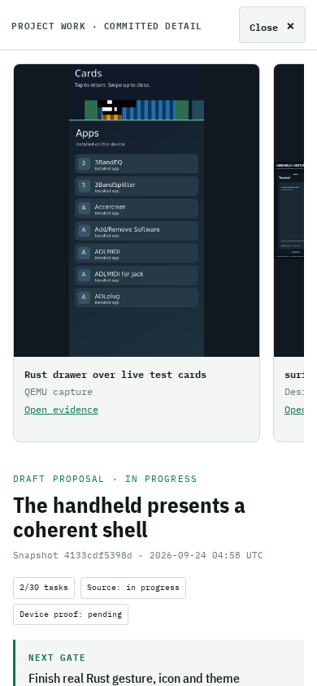
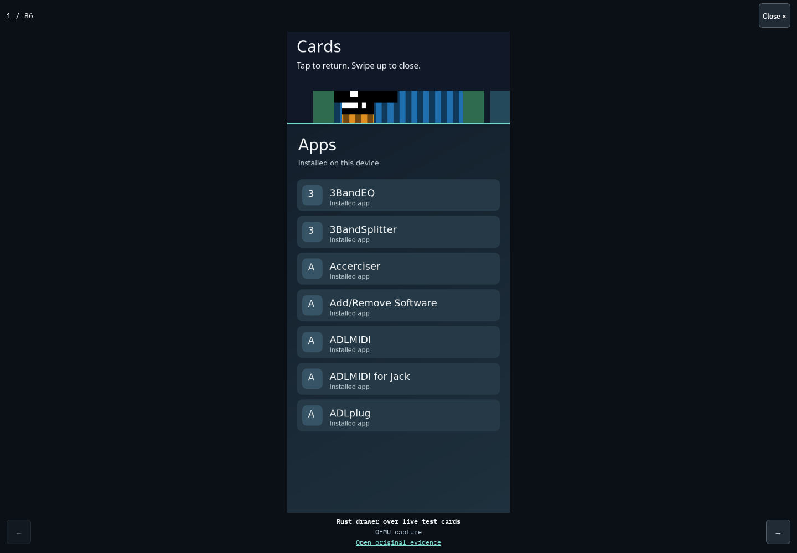
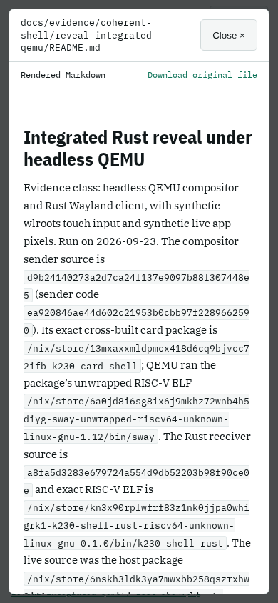

# Work card media and evidence access

Host browser proof recorded 2026-09-24 at source
`4133cdf5398db99f58fd0b3398ebfec22f288245`.

The work board discovers committed images, videos, reports and logs from
change citations and the associated evidence records. A reviewed override
selects the coherent-shell card's QEMU screenshot; it remains explicitly
labelled QEMU. The gallery and evidence menu do not alter completion or
physical verification state. New evidence is discovered on the next normal
site build, including before a proposal completes or archives.

```sh
python3 tests/test_work_board.py
python3 tests/test_render_specs.py
python3 scripts/build_site.py
python3 tests/work_card_media_browser.py
```

- Discovery: 17 tests passed, including new images and videos arriving while
  a proposal remains open, revision consistency, missing/uncommitted media,
  private sibling names, symlinks, duplicate handling and reviewed video covers.
- Spec rendering: 21 tests passed.
- Full site: 235 pages, 7,663,684 bytes, 27.96 seconds. All 12 output checks
  passed; output is below the existing 8 MiB and 120 second budgets.
- Playwright Chromium: both 1440×1000 desktop and 390×844 mobile passed cover
  coordinate clicks, inline gallery, real video playback, independent evidence
  menu, local Markdown report links, Enter/Escape and focus restoration. No
  horizontal page/dialog overflow or JavaScript errors occurred.

The browser command serves the local build and maps revision-pinned raw
media URLs to the corresponding local repository files. It actually decodes
and advances the existing system-controls MP4. This is host website behavior,
not remote deployment or a new board interaction. Reports render Markdown;
raw logs, tables and media link directly to their pinned revision to keep the
static bundle bounded. Dialog media stays inert until a card opens; videos
have controls and never autoplay.

The coordinator visually inspected these public browser captures:





The initial card/media implementation was published at
<https://knewter.github.io/tdisplay-k230/work/>: Pages run `35958300081`
succeeded and the page contained source revision `1005d4f5a538`.

## Viewport gallery and document modal

Additional host browser proof recorded 2026-09-24 at source
`046ae6082a92b281d0a0e4e05343dfa29b524027` using:

```sh
python3 scripts/build_site.py
python3 -u tests/work_card_media_browser.py
```

The build passed: 238 pages, 8,043,984 bytes, 12.99 seconds and all 12 output
checks. Desktop (1440×1000) and mobile (390×844) Chromium both passed:

- Images fit the available viewport without cropping; arrow navigation and
  actual mobile touch swipes move through the gallery.
- Video starts paused, plays and advances when requested, and stops/releases
  its source when closed.
- Inline and header evidence open document modals; Markdown is rendered and
  logs/data use bounded text previews. The board URL stays unchanged.
- Escape/Close returns to the same card and restores focus; header previews
  also work without opening a card. No JavaScript errors occurred.

The coordinator visually reviewed the desktop gallery and mobile document
captures below. The browser routes pinned raw artifacts to local files; this
is host website proof, not new device evidence or remote deployment proof.
The explicit original-file action may open the original separately; ordinary
card evidence clicks stay in the modal. Publication of this extension is
recorded separately after CI.





## Viewer playback update

At source `28cc0fbde32475f59a00f5e48737faa6c9a4c183`, the viewer starts
video playback when a reader opens or selects a video. Card previews remain
paused. Space toggles playback with focus on Close or on native video
controls, without dismissing the gallery or toggling twice. Native controls,
Escape/Close, stop-on-close, and card focus restoration remain available.
This supersedes the earlier no-autoplay viewer behavior above.

`python3 scripts/build_site.py` passed: 239 pages, 8,060,379 bytes, 28.60s.
`python3 -u tests/work_card_media_browser.py` passed desktop and mobile,
including automatic video advance, Space pause/resume from Close and native
video focus, and all prior media/document modal checks. Browser autoplay
restrictions may still require pressing Play; controls remain usable.
